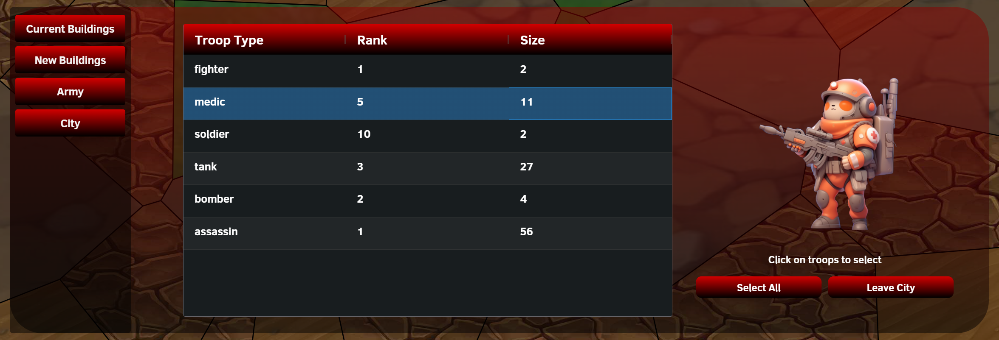
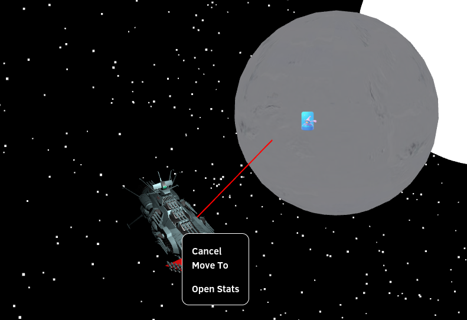
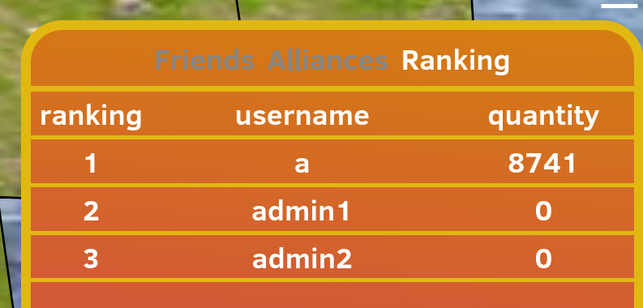
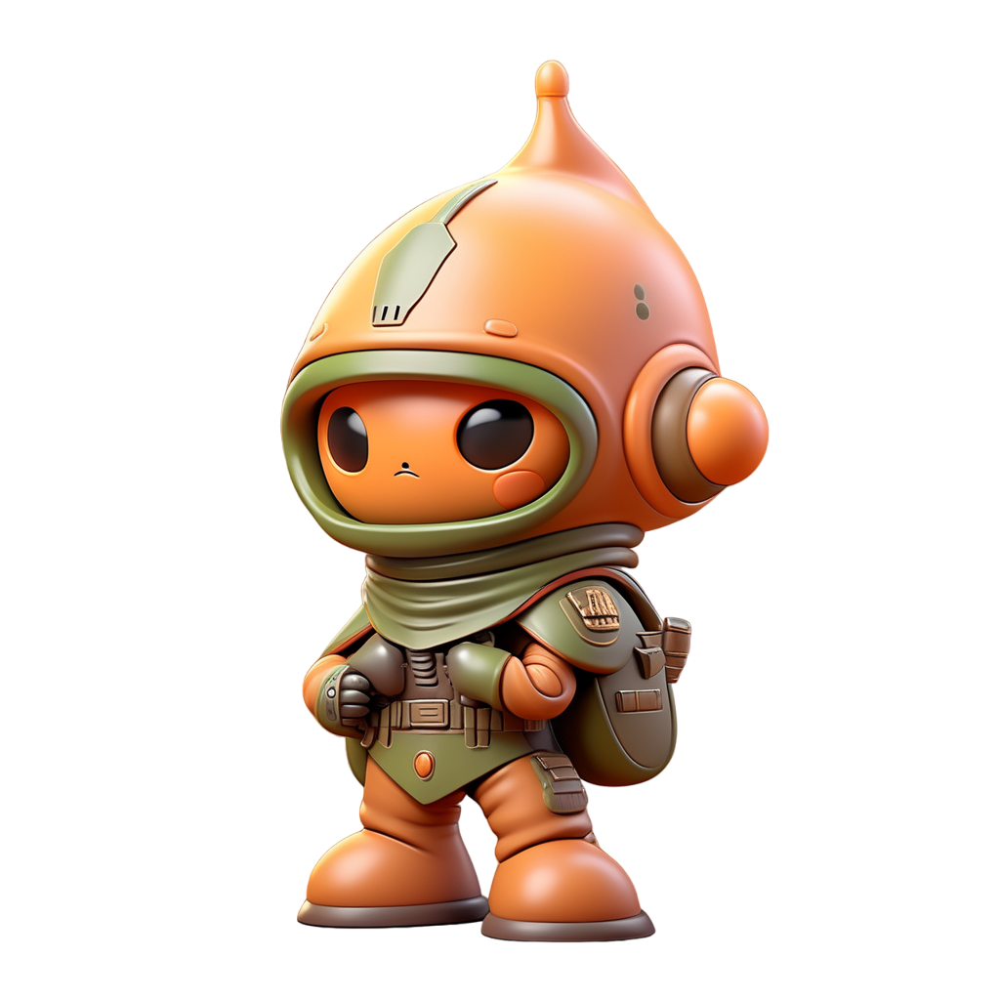
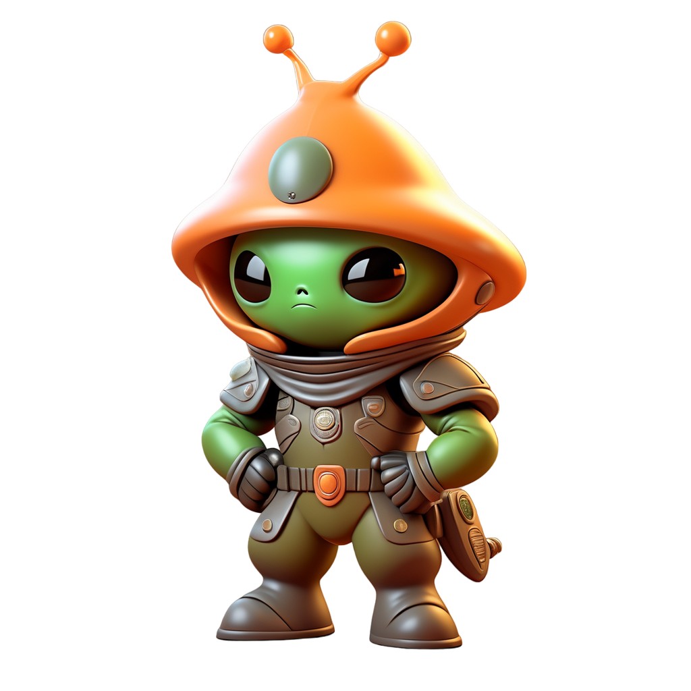

# Table of Contents
- game_explanation
	- [general_explanation](#339dea85-d386-41c6-a542-d21618b71d44)
	- [armies](#ba4f1513-6c8e-4911-9cd5-ac4ad5c7be1c)
	- [city_management](#d3342790-69b6-4542-9ffb-caca03efd9af)
	- [fleets](#82303d8e-0565-4153-a9f4-e67be6a757b0)
	- [planet_view](#5a5922bb-c970-4dc8-bfb7-83039ee0ee66)
	- [scene_setting](#24376774-4247-4cf1-9e43-b2c4d11fe4ad)
	- [trading](#1d46e28f-7e44-4faf-914c-c7e59f69eb4f)
	- [user_experience](#db442a62-8416-488e-b664-525506189e0f)
	- [user_interactions](#9c759c9c-ef0d-4864-ae3e-30f90d149414)
- backend
	- [army_combat](#8e628208-631f-41de-98f0-97fef716b480)
	- [authentication](#00a151e9-d72d-491b-a7e1-483f0d9588d1)
	- [backend_structure](#be1d9a14-c66a-42f2-a2e3-5120ca9e02be)
	- [config](#d6e5c883-de1e-4a46-b947-9c97edee81bf)
	- [database_access](#f933743a-e30f-42d3-939a-70222922b049)
	- [database_connection](#9896ecd6-5195-454a-87d0-169a0370ce12)
	- [database_model](#86694db2-9078-425d-b90a-24f56b013c5e)
	- [endpoints](#d16907d9-37b3-43c3-8ad1-c658eac8803b)
	- [general_modifiers](#399af4e0-4948-4b31-a7ec-1f1bb83e9fc8)
	- [global_ws](#e1252886-5549-4a6d-b794-e1df8513ac36)
	- [logging](#258ee5c9-b7a2-4134-9de8-d6b338f1626e)
	- [maintenance](#76310ffa-6393-4270-9dab-492f2741fb45)
	- [planet_generation](#7d279bc9-c0b9-402a-a799-77fee3697d4c)
	- [planet_name_gen](#9229c9a7-4f7b-4472-9b03-f49da130ff15)
	- [planet_socket](#aa1cdd67-12af-48bf-91ab-46dd586fb7be)
	- [snapshotter](#c53c7c73-73de-404b-b306-b4ad9c2b94a8)
	- [spawn](#7a09ed8f-338b-458b-b9c3-c969e8a49f05)
	- [testing_setup](#f2738260-613d-4ea2-a8dd-1a3227ca0765)
	- [trading](#fa47e3bc-197e-4c8a-8b21-73adbe9cdfe6)
	- [training_units](#02649846-19c5-4a54-b0b9-76561d100f93)
	- [websockets](#9294361b-1fdb-42b0-b794-0cf63934dcea)
- frontend
	- [army_movement](#06b1e1c5-8b35-4138-a6dc-74fe2398d71a)
	- [army_viewer](#75dfd107-e958-4b39-993a-08151b520f31)
	- [chat_menu](#4de353d1-75d5-44e3-b9f1-b7ffec32a9a7)
	- [city_viewer](#9cdc34b5-98e6-4f45-8894-98ecbc017535)
	- [combat_notifications](#27ed3d46-7712-47c8-90d2-80463b587d35)
	- [fleets](#e5387019-ebdf-4730-b502-035a32eb5c4d)
	- [galaxy_viewer](#b8501cc7-d0c0-4984-bae8-8ebd71973a61)
	- [general_view](#f8a10c3f-dbca-491f-a133-94591d7bf138)
	- [hidden_windows_viewer](#280cf087-4d69-4097-a4b6-3e81eab187f3)
	- [login](#42973491-c0e7-4175-99b9-fd9b92814424)
	- [planet_viewer](#2ee1e4a6-7120-42f3-ac9f-993e1d0ac43e)
	- [planet_visualisation](#df3cf30c-1e41-4f43-b96c-1411b5df9ede)
	- [politics_menu](#3035f6ba-49f4-4a3e-a794-40a709ad274b)
	- [profile_viewer](#edd6d10b-965b-4515-841c-c6f236f3785c)
	- [resource_viewer](#ad00bd84-6451-4a1a-a949-7ba11966d8d5)
	- [settings](#251e5841-009c-4852-b9bc-62facc9b0860)
	- [sidemenu](#1fb0a93d-5b4a-4b84-b697-8cd4143ad428)
	- [trading](#acb66510-e674-48df-bcd6-dfdf5671176b)
	- [training_viewer](#0e1ac9b0-1e62-419e-82b8-c726e9f10353)
	- [window_ui](#80470438-4a77-4954-a12e-8bf71c9aa1af)
- game_mechanics
	- [army_combat](#be602d32-9fc2-47f1-9cff-e9b67fafc937)
	- [buildings_productions](#b2e07711-c2f0-4dfb-81be-4ffdf545b937)
	- [city_construction_and_expansion](#2cb05002-fa20-4bfe-9a15-b632c337f10e)
	- [generals](#746b8856-c960-4617-bafb-839c6fd85c19)
	- [maintenance_cost](#4f643178-0498-494a-b3a5-b038f191fcbc)
	- [planets_regions](#51ed9bf5-68c4-41c7-8eb9-5d610312da25)
	- [politics](#a0db1a47-8be0-4cf9-a8be-936632873c93)
	- [resource_types](#f6d5ce08-371c-4dfd-a735-d0d6a26f6fe8)
	- [tower_types](#2de944d2-dd73-4548-a8b9-4ed0270358d8)
	- [unit_types](#50314568-67c9-4f6d-ad38-5e5aa5a112d4)
	- [wall_types](#4f7b6a94-207b-4549-a7f9-cf444957f20b)


<hr style="border:2px solid gray">

<a id='339dea85-d386-41c6-a542-d21618b71d44'></a>
# Solarin
Our game is an IDLE strategy game. The user playing our game will control a space civilization of an alien race.
Cities will be founded, and armies will be raised. Users will be able to fight each other using these armies, and try to conquer 
each other's cities. Each city has buildings, that can produce resources, train troops, ...
Users start on a single planet, where they can grow their civilization. Later on, users will be able to travel to other distant planets.
The goal of our game is to grow your civilization as much as possible, by conquering and working together.
The other documentation files inside the `/general_explanation` will shed some more light on the most important
game features. 

## IDLE mechanics
Our IDLE components mainly consist of time delays, and duration.
- Buildings that produce a certain resource, have a production of X amount of resources per hour (So the user needs to wait some time).
- Training Troops for your armies will take time.
- Moving Armies, will take a couple of hours depending on the distance.
- Adding/upgrading buildings will need some time to do the construction.

## Strategy mechanics
Our game will have a great deal of strategy and conquest. 
A lot of tactical decisions will be made with regards to managing cities, waging war, and working together with 
fellow users. The amount of time a user spends growing a civilization will give the user an advantage, 
but strategy will make it possible to overcome the head start of other players. 
Players will of course be able to make an account and login after a while to see their IDLE progress.

We make the strategy aspect possible by letting the user make a lot of decisions that may or may not help the user.
Modifiers will be provided to make the decision taking more important (ex. based on the type of region  the production rate modifier might change).

## Features:

### planet map
In our game we have a map that visualizes a planet.
- Visualization of a planet map
- Automatic generation of the planet + planet regions using voronoi
- Use planet to do actions on that planet

### planet regions
Each planet exists of multiple regions
- giving modifiers (to production of specific resources) to city situated on a region
- Extra modifier when the user has full and only control of the region

### Cities 
Cities can be created on a planet and be used to produce resources, train units,...
- Visualization of city on planet map
- City menu displayed when city clicked. Containing (Current buildings, new buildings (that we can build)), army in city info, and city info.
- Category selection TAB to change what the user sees
- Use cities to IDLE produce resources
- use cities to IDLE train troops
- IDLE upgrade the city
- IDLE upgrade the buildings inside a city
- Build new buildings inside the city
- Display city information, its region modifiers, population, maintenance cost
- Visualization of each building inside the city (using an image) on hover
- Change city visualization based on city rank
- Change city production/training level based on building level
- Cities can have Towers and Walls to improve the city its combat stats
- When Space Dock is built, the planet is visible to other players too
- City combat stats visualized
- Click outside city menu widget to close menu
- Make upgrade/build buttons not clickable when not enough resources

### Armies
- Be able to have armies
- Create a city using an army
- Move an army across the planet map (IDLE takes long time)
- Armies can attack other armies and cities
- Armies of the same user can merge with each other
- Armies can enter its own city
- Armies can be split, both when in and out of city.
- Troops that are trained are added to the army inside the city
- Armies can be moved through space by having a 'mothership' troop.
- Army stats can be seen as details
- Display which troops are part of this army + rank + amount
- Make part of the army info hidden for other users
- Army general can be assigned giving the users bonuses based on the general and the user its political stance
- Army maintenance can be seen both in and out of a city
- visualize a line for army movement
- Combat Notifications about the battle results
- Army combat based on formula (can occur IDLE)

### Galaxy map 
A 3D view of the galaxy provides the visualization of the planets in space.
- 3D visualization
- Uses Generation algorithm to generate the position of the new planets (Fibonacci Spiral)
- Only allow a user to visit a planet when the user has something on that planet
- Only display planets that can be visible
- Another planet is only visible if there is a 'space dock' present on that planet
- Transport armies through space (using a 3d FLEET)
- visualize a line for fleet movement
- Button to go to galaxy view
- Double-click on planet to go to planet view

### Trading
Users can trade with each other (in same alliance)
- Being able to trade resources
- Cancel your own trade
- Accept someone else its trade
- use filters to filter for specific resources
- Create trades

### Chat
The communication aspect of the game
- Being able to send friend requests
- Being able to accept and reject friend requests
- Being able to send dm's to another player
- Being able to request to join an alliance
- Accept/Reject alliance requests
- Kick someone from the alliance
- Leave the alliance
- Open the alliance chat (chat between all users in the alliance)
- See a ranking between players, based on their amount of solarium a user has

### Resources
The user is able to obtain resources
- Visualization of the current resources
- Actions require certain resources, and they cannot be done when not enough resources
- Production buildings produce different resources
- Different resources used for different things

### maintenance Cost
Let Cities and armies have maintenance cost (resources /hour)
- Live update maintenance cost on resources
- Visualize maintenance cost for army in/out of city and for city itself
- When not enough resources, troops starve: losing troops, and buildings are being removed (slowly)

### Game Over
game over detection
- respawn the user when game over (no cities and armies)
- Added Game restart button in settings menu

### Hideable
making certain UI components hideable
- make it possible to hide certain UI components (in case you need access a city just hidden by this component)

### Settings
having a settings menu
- Provide restart button
- Let the user customize the visual UI Colors
- Button to make these colors persistent
- Click outside widget to close

### Side Menu
Small button right top corner
- Option to open setting menu
- Sign out button

### Planet switcher
Switch between planets the user has an army/city on
- Use switcher arrows to quickly switch between planets

### ProfileView
When we click on profile button (left bottom), we get the profile view, 
that displays useful user information
- Category selection Tab
- Visualize list of all the cities of the user (Cities Tab)
- Visualize list of all the armies of the user (Armies Tab)
- Go to politics menu using Politics tab

### Politics
By changing the ideology, the user gets different modifiers
- Visualize Radar graph of the ideology spectrum of the user
- Visualize modifiers based on current ideology
- Provide decisions that can be taken to make changes in the ideology
- Modify army general stats based on political stance
- Change general modifiers based on political stance

### Training
training of troops
- Let troops be trained
- Training queue for each barrack, which will IDLE train troops
- Slider to select how many troops need to be trained
- Display the stats of the troop (corresponds with amount trained) when we would train these troops
- Display the costs of training these troops


<hr style="border:2px solid gray">

<a id='ba4f1513-6c8e-4911-9cd5-ac4ad5c7be1c'></a>
# Armies
Controlling armies is a vital part of our strategy game
<br>
When we select an army (assuming we select an army controlled by the user self)
We can click 2 buttons: 'Move To' and 'Details'.
The Move To can be selected, when we click after on a place on the map, our army will move to the
provided position (using IDLE long times, but does also update live). When we click details another window appears.
'Create City' makes it possible to create a new city on the position of the army. 

If another city is to close, a pop-up message will appear (global notification) that another city is too close to
create a new city.

The stats visualize the stats of the army, which will be used to calculate battle outcomes.
We can also see which units are part of this army.

An army can also attack other armies/cities by clicking on that army/city when deciding the movement.
When the army arrives, it will calculate the combat results, and remove the defeated armies/ change city ownership accordingly.

When an army clicks on its own army it will move towards that army and when it arrives will merge both armies.
When an army moves to its own city, it will enter the city.
To indicate which action will be done, Cursor indications are given when hovering over another city/army

We chose to do army actions with OnArrive events.
This means that we keep track of when an army would arrive at the selected location
When it arrives, we will trigger an 'onArrive' event, and to the necessary checks.

### Splitting up an army
If an army consists of multiple troops, it may be desirable to split up the army. 
This can be done by selecting the troops which you wish to split off, and press the "split army" button.
<br>


<br><br>
Fleets, which are armies with at least one mothership unit,  are just like armies in terms of combat, merging, moving, viewing stats, etc... However, they can also enter and exit planets. 


<hr style="border:2px solid gray">

<a id='d3342790-69b6-4542-9ffb-caca03efd9af'></a>
# City Management

When you click on a city you own, the following menu appears:
<br>

### Current Buildings Tab
By default, you are in the Current Buildings tab. On the left side, there are four tabs.  Each entry in this table represents a building, displaying the building name, rank, and purpose type. When you hover over a row entry of the building list, an image of the building appears on the right side:
<br>

Below the building image, additional buttons appear. These buttons vary depending on the type of building. Buildings that produce a resource have a 'Collect' button, while barrack-type buildings have a 'Train Troops' button. An upgrade button is also available for all building types to increase building ranks and improve their stats.

Pressing the 'Collect' button adds the produced resources of the building to the user's resources. The 'Train Troops' button opens a training interface:
<br>
We chose to implement this IDLE mechanic by keeping track when the last collect (update of this building was), and calculate the time difference
between then and now to calculate how much the user would receive

The current training queue for this building type appears. If the queue is too long, horizontal scrolling is possible using the mouse scroll. In the lower half of the menu, you can select a unit and use the slider to decide how many you want to train. Pressing the 'Train Units' button adds the unit to the training queue.

### New Buildings Tab

Selecting the 'New Buildings' tab shows the following:
<br>

This displays a list of buildings you can still construct within the city. If the build button is gray, you do not have enough resources to build the building. Pressing the 'Build' button initiates the building process.

### Army Tab

The army tab shows all the troops present inside the city, grouped as one army:
<br>

#### Split Army
Troops can be made to leave the city and form an army on the map.
This can be done by simple clicking on the troops you wish to form an army with, and then press the leave city button.
Alternatively, press the "select all troops"-button and then press the leave city button, to have all troops leave the city.


### City Info Tab

The final tab is the City Info tab. It contains relevant information about the city, such as the population (determined by the rank), the region type in which the city is built, and the production buffs that apply as a consequence:
<br>

Pressing the 'Upgrade City' button starts the process of upgrading the city to the next rank. The button will appear as grey and disabled in three cases:
1. The city is currently being upgraded 
- the button will then display the remaining update time, and updating will be possible again once this timer hits 0.
2. The user has insufficient resources for an upgrade
- In this case a city rank upgrade is possible, but the user has insufficient resources. The button will be enabled again once sufficient resources have been acquired.
3. The city is rank 5
- The maximum rank a city can have, is rank 5. Once this rank is reached, no further upgrades are possible and the button will remain disabled indefinitely.


<hr style="border:2px solid gray">

<a id='82303d8e-0565-4153-a9f4-e67be6a757b0'></a>
# Fleets 
<br>
Fleets, which are armies with at least one mothership unit,  are just like armies in terms of combat, merging, moving, viewing stats, etc... (See /game_explanation/armies).
However they can also enter and exit planets.
<br>
Fleets can enter planets almost the same way as armies can enter cities. However (currently) when a fleet enters a planet it spawns in the middle of the map.
Another difference is also a red line indicating the current position selection. Armies will enter a planet using an 'OnArrive' event
<br> 
In order for a fleet or multiple fleets to exit a planet, the user must click the planet -> show fleets -> exit planet. After which the fleets should spawn next to the planet in space.


<hr style="border:2px solid gray">

<a id='5a5922bb-c970-4dc8-bfb7-83039ee0ee66'></a>
# PlanetView

The view of a planet looks something like the image below:
<br>
A planetView contains regions (marked by the black lines). Each region is just represented by a point on the map,
deciding in which region somthing is, can simply be done by checking which region point is the closest.

Planets have their own types, and so do regions. Certain regions can only exist on certain planet types.
We also see cities, by clicking on a city the city menu will open (at least if you are the owner of this city).

We Also see armies on the map. Websockets make it possible to see army movement and changes live, but be aware movement 
takes some time, so you might not see this visually.


<hr style="border:2px solid gray">

<a id='24376774-4247-4cf1-9e43-b2c4d11fe4ad'></a>
# Scene Setting
The game takes place in the future where technologically advanced societies, 
both human and alien, have expanded beyond their home planet and have started colonizing new ones. 
The player will control a new civilization that just figured out how to make space travel easier and more efficient. 
With this new technology and due to increasing resource scarcity the entire 
race has come together to start expanding outwards. During their rise to an interstellar civilization, 
they will have to conquer new territory, defend their own and make deals with other civilizations. 
All in the hopes of one day becoming one of the greatest civilizations in history.  


<hr style="border:2px solid gray">

<a id='1d46e28f-7e44-4faf-914c-c7e59f69eb4f'></a>
# Trading

Trading between users is a vitale part of improving the strategy component behind our game
Users can only trade with players in the same alliance, and so when a player is not yet in an alliance,
the player cannot use this feature.

When You open the trading menu you will see the following page:
<br>

In The top of the screen we see a list of resources. You can click on such a resource to set a filter 
to see the trade offers containing this filter.

Trade offers list 2 things. Your own placed trade offers and others their placed trade offers.
Filters will be checked on the resources the checking user will receive when the offer is accepted.
Own trade offers appear at the top and can be cancelled using the red cancel button.

Others their trade offers can be accepted using the green accept button.
When your own offer is canceled your offered resources will be refunded. When a trade offer is accepted,
the resources will be exchanged. When a user does not have the resources to accept the offer, no accept button
will appear.

Users can also create trade offers.
Among the resources a 'PLUS' icon appears. <br>
When we click this button a create trade offer menu will appear.

<br>
Both The receive and give side have a scrollbar with resources that you can select.
When selecting you want to trade that resource, and you can choose an amount.
Clicking the accept button will confirm your trade offer.

To make this window update live, we use a websocket with a websocket pool for each alliance, so when a change occurs, it will
update for all users in that alliance, that have opened the menu.


<hr style="border:2px solid gray">

<a id='db442a62-8416-488e-b664-525506189e0f'></a>
# User experience

We allow users to grow their civilization by conquest and colonization. Cities can contain buildings that can be upgraded by the user for a certain price (in resources). The upgrades will improve certain things about the building or give access to new things (producing more, training new kinds of units, ...). The thrill of conquering the settlements of other players and the fear of losing your own will encourage players to check the game frequently.  The game mechanics with regards to battles are the following: Both armies and cities have battle values (attack, defense, ...) deciding how strong they are in battle. An army its battle values will depend on the troops inside its army. Each type of troop will influence these values differently. Players will be able to strategize about their army composition. Some troops will cause a larger increase in attack and others increase the army their speed and so on. Armies can attack cities and also other armies that are present on the same planet. Cities will also have battle values by building/upgrading towers and walls. Armies can also be stationed inside a city to help defend against invading armies.   

Currently we are considering the following values: 

Attack: This value will be used in a calculation to see who wins the battle 

Defense: This value will be used in a calculation to see who wins the battle 

City Attack: Attack value that will only have an impact when fighting for control of a city. 

City Defense: Defense value that will only have an impact when fighting for control of a city. 

Recovery: will influence the number of losses of an army after a battle. 

Speed: Will influence the average speed of an army. 

The idea about City Attack/Defense will be that they influence only a part of the defense used 

For example: for a city (70% City defense + 30% normal defense). 

 

To make sure a player has the capabilities to start the game without risking direct conflict with major players. A player will spawn on a planet that in the worst-case scenario is populated by some other starting users. This planet will be for a given time invisible on the Galaxy View map for other players. To stimulate players to travel and colonize other planets we divide our planets into regions. Certain resources cannot be obtained in a certain region and in many cases, not all the required regions will be present on one planet. This means that players need to move to other planets to gain all kinds of resources. We also encourage taking control of an entire region by giving bonuses to a region that is fully controlled.  

In our vision, each planet typically undergoes phases, where the phases can increase but also decrease. 

Phase 1:   

Starts when the first player spawns on the planet and ends when starting on the planet would be too difficult for newest players. In this phase the planet is invisible to players who have not started on the planet to ensure the game is balanced 

Phase 2:   

The PVP phase of the game where players on forced to either form alliances or fight to gather resources and expand. This is when the planet becomes visible to others and therefore possible to invade  

Phase 3:  

The phase where one player or alliance comes out victorious and controls the entire planet 

 

Other features like Generals, Trading, etc. will give players the opportunity to really try their strategic endeavors and differentiate themselves from other players. The opportunity to create your own direction and focus will make the game more interesting and will stimulate players to spend a lot of time thinking about their next moves. Giving players the opportunity to communicate and work together with other players will also make the user-experience more engaging. 


<hr style="border:2px solid gray">

<a id='9c759c9c-ef0d-4864-ae3e-30f90d149414'></a>
# Interactions

Users will control a space civilization managing its cities and navigating its armies.   

Our Game universe is filled with planets, on a planet a user starts with a city. Buildings can be built inside a city. A building produces certain resources, trains units, etc. Planets are divided into multiple regions (DesertRegion, PlainsRegion, ...). Depending on the region the city is situated in, we will be able to produce certain resources. New cities can be created by users (within certain constraints).   

Using ‘Barrack’ buildings units can be trained. Units will be assigned to an army. These armies can be controlled by the user: moving the army or using the army to attack/defend a city. When attacking a city, it will take over control of this city (if it wins this attack).   

Moving armies to their required positions will take time depending on the distance. Armies can both travel on the planet itself and go to other planets. A general can also be assigned to an army to give it some modifiers (ex. +10% attack).   

Players will be able to join an Alliance with other players and communicate with them. An alliance will make sure that players don’t attack each other and might work together.  

Our project will consist of 2 map views:  

A view of the planet containing the regions, cities and armies that are on the given planet. This will influence certain travelling times but will also contain information about which users have cities in the same region.  

A galaxy-wide map containing all the planets present in the game. Armies can also be controlled on this map and can be sent to other planets. When the number of players increases, the number of planets will also grow. Planets far away will be more difficult to reach. In the future we might also add extra things to do in this view if the time allows it. 

 

In addition, we are also looking at some form of trading resources between players and making it possible to give a civilization some political aspect, like defining if your civilization is a democratic or dictatorship, etc. This choice will set some modifiers.  


<hr style="border:2px solid gray">

<a id='8e628208-631f-41de-98f0-97fef716b480'></a>
# Army Combat

## Overview
Explanation how combat of an army works


## Description
The combat of an army exists of 2 parts. The first part is detecting when combat needs to occur, the second part is to do the combat calculations and change the
stored data accordingly.

For detection of combat we use the Table 'onArrive'. This has polymorphic children: 'AttackCity', 'AttackArmy', ....
When a user decides to attack an army/city it will store that information in these tables. When our army later arrives on
its destination, we check these tables. If we find a matching table entry (with our arrived army) we will execute the calculations.
Armies cannot attack their own armies,cities or those of their allies

Army movement on a planet is done with websockets to get real time updates, to be able to directly update combat when players are online,
We will calculate the remaining time needed before an army arrives (and would start the combat). We make an async tasks with a delay so it only does the 
check after the army would arrive. If the entry does not exist anymore by then, the check will just ignore it.
When the check occurs, the websocket will send a 'reload' message to the clients, so frontend can reload de cities and armies, to
keep it in sync. Doing the check occurs in the file 'ArriveCheck.py'. Using websockets, an army can also provide whether it is going to attack an army/city using
the same request it uses to change movement.

Doing the combat calculations (ArmyCombat.py): We use the formula's described in game_mechanics army_combat.
We also apply the losses to each troop entry of the winning army. Losing armies will be removed, and when a city failed to defend himself
the attacker will become owner of the city. And the conquering army will enter the city. 

Armies that are presented in a city while it is attacked, will help defending the city, but will take losses when the defense is victorious. (if it loses they will just be removed).

Another aspect of controlling armies, is being able to enter cities with your army, and to merge armies.
This uses the same system as the attack: 'onArrive' events. This has 2 polymorphic children: 'MergeArmies', 'EnterCity', that store whether
to merge armies / enter an city when the army arrives at its destination.

All the on Arrive event handeling occurs in 'ArriveCheck', this will make sure the right action is triggered.


<hr style="border:2px solid gray">

<a id='00a151e9-d72d-491b-a7e1-483f0d9588d1'></a>
# OAuth2 with Password (and hashing), Bearer with JWT tokens

## Overview
This is how users can sign-up or sign-in to the game.

## Technologies used
- fastapi
- sqlalchemy
- postgresql
- pyton-jose
- HS256
- oath2
- passlib

## Description

### Auth router
We created a seperate fastapi router for authentication.
This router has 2 endpoints:
- `/add_user` - register a user
- `/token` - login a user by getting a JWT token in return

### Password hashing
The requested password will be hashed. This is to ensure incase the database gets stolen, the users's passwords won't be in plaintext. The library we used to hash passwords is `passlib`. And the algorithm we used is `Bcrypt`. 

By creating a password context, hashing and matching passwords can be done easily.
```python
pwd_context = CryptContext(schemes=["bcrypt"], deprecated="auto")
# verify
pwd_context.verify(plain_password, hashed_password)
# hash
pwd_context.hash(password)
```

### JWT

Our JWT tokens are generated with the python library `python-jose`. The algorithm used to sign the JWT is `HS256`. We also generated a secret key for generating the token. And an expiration time is also specified. Now if a user logs in succesfully they get a token in response.

With this token we can retrieve the user id for all the user specific requests.

### Adding users

For adding a user, sqlalchemy will try to insert a user to the table. If this fails the email or username are already be inside the database.


## Additional Information

- make sure you read this section about JWT: https://fastapi.tiangolo.com/tutorial/security/oauth2-jwt/#about-jwt 


<hr style="border:2px solid gray">

<a id='be1d9a14-c66a-42f2-a2e3-5120ca9e02be'></a>
# Backend Structure

## Overview
Explanation about the backend file structure/organization

## Description
Our backend file structure is completely in the 'backend' directory
```
.
└── backend/
    ├── logs/
    │   └── logs of backend
    ├── migrations/
    │   └── migrate database model to real tables using alembic
    └── src/
        ├── app/
        │   ├── database/
        │   │   ├── data_base_access/
        │   │   │   └── access methods to access information from the databse
        │   │   ├── models/
        │   │   │   └── database models
        │   │   └── exceptions/
        │   │       └── database access exceptions
        │   ├── fill_db/
        │   │   └── setting up database (Adding resource types, ...)
        │   └── routers/
        │       └── routers/endpoints to access backend
        ├── logic/
        │   ├── combat/
        │   │   └── handling of army combat
        │   ├── formula/
        │   │   └── calcualting formula used in calculations
        │   └── name_generator/
        │       └── name_generator for random planet name
        └── tests/
            └── backend_testcases
```


<hr style="border:2px solid gray">

<a id='d6e5c883-de1e-4a46-b947-9c97edee81bf'></a>
# Config

## Overview
How we will be doing configuration in our backend

## Technologies used
- [confz](https://github.com/Zuehlke/ConfZ)
- [pydantic](https://docs.pydantic.dev/latest/)

## Description
Our configuration is done using the python library confz. This is an easy to use library. You can define a configuration using pydantic types. And the input configuration will be validated. 

```python
from confz import BaseConfig, FileSource
from pydantic import SecretStr, AnyUrl

class DBConfig(BaseConfig):
    user: str
    password: SecretStr

class APIConfig(BaseConfig):
    host: AnyUrl
    port: int
    db: DBConfig
```

You can load a config from many different source types:
- FileSource (jaml, json, toml)
- EnvSource (env variables and .env files)
- CLArgSource (command line arguments)
- DataSource (constant config data)


## Additional Information


<hr style="border:2px solid gray">

<a id='f933743a-e30f-42d3-939a-70222922b049'></a>
# Database access

## Overview
How we access and store data in the database

## Technologies used
- sqlalchemy (async)

## Description
Access to the database will be Encapsulated by a class: 'DataAccess'
by calling its member function we are able to communicate with the database.
To increase readability, the methods are divided into categories: UserAccess, CityAccess, ...

One special category is 'DeveloperAccess', its member functions are only supposed to be called by developers.
This can be used to create new types of buildings, troops, etc. 
This makes it easy for developers to add these features to the game. 
These tables will often be considered 'lookup tables' (user actions will not cause a change in its information).
This category can also provide methods for developers to do actions ordinary users are not allowed to do 
(ex. speeding up time, for debugging).

Other categories will have methods related to their category.
The dataAccess methods are asynchronous (to reduce response time) and so need to be called
from an asynchronous function. Using the 'DataAccess' method, all the other Access methods can be accessed 
(ex. ```DataAccess.UserAccess.createUser(params)```).

An overview of the current DataAccess categories:


| Category        | Purpose                                                 | Extra Info                                                                                                                                           |
|:----------------|:--------------------------------------------------------|:-----------------------------------------------------------------------------------------------------------------------------------------------------|
| AllianceAccess  | methods that manage alliances                           |                                                                                                                                                      |
| ArmyAccess      | methods that manage armies                              | Everything related to armies can be accessed from here                                                                                               |
| BuildingAccess  | methods that manage buildings                           | Everything with regards to a building can be managed from here, that also means all types of buildings                                               |
| CityAccess      | methods that manage cities                              |                                                                                                                                                      |
| DeveloperAccess | methods that manage developer only actions              | Every table whose entries are changed from this access, are meant as lookup tables. Changing these tables from another Access is highly undesirable. |
| MessageAccess   | methods that manage all message operations              |                                                                                                                                                      |
| PlanetAccess    | methods that manage Planets & Regions                   | This Access method will mainly be used to create the surrounding environment of the game                                                             |
| TrainingAccess  | methods that manage training units                      | This Access method will only take care of training units                                                                                             |
| UserAccess      | methods that manage User accounts                       |                                                                                                                                                      |
| RankingAccess   | methods that manage ranking information                 | User rankings will be done with regards to the amount of Solarium a player has/produces                                                              |
| ResourceAccess  | methods that manage resources of users                  |                                                                                                                                                      |
| TradeAccess     | methods that manage trading between users               |                                                                                                                                                      |
| GeneralAccess   | methods that manage generals and its relation to armies |                                                                                                                                                      |

## To Verify
The entire database (tables and sequences) need to be present.

## Exception Handling
Not all the actions using these data access methods are allowed. For example users are not allowed to move
enemy armies. We handle this by throwing appropriate exceptions. To give this error handling structure, we
use custom exceptions.

| Exception              | Purpose                                                                                                                                              | example                                                        |
|:-----------------------|:-----------------------------------------------------------------------------------------------------------------------------------------------------|----------------------------------------------------------------|
| DataAccessException    | This is the base class for all the exceptions related to data access (all entries in this table will be a derived class of this DataAccessException) |
| PermissionException    | This exceptions is thrown when the user has not the rights to execute this data access method using its provided parameters                          | modifying other users their cities/armies                      |
| DomainException        | This exceptions is thrown when an equivalent of the postgresSQL domain check fails                                                                   | Positive intger < 0                                            |
| InvalidActionException | This exceptions is thrown when a user does an action that is not allowed given the parameters and/or the data of the database                        | Send a friend request to someone who is already your friend    |
| NotFoundException      | This exceptions is thrown when a required entry is not found inside the database                                                                     | update the status of building id -1 (but id -1 does not exist) |


## Additional Information


<hr style="border:2px solid gray">

<a id='9896ecd6-5195-454a-87d0-169a0370ce12'></a>
# Database connection

## Overview
How we establish sessions for our database

## Technologies used
- sqlalchemy (async)

## Description
The configuration for connecting to the database is done using confz.

Upon staring up our API we establish a connection to the database.
We create a async_sessionmaker which will generate async sessions for us to use inside the api.

If the API shuts down our connection to the database is gracefully closed. 'database.py' handles this connection
## To Verify
Make sure the configuration is correct with the database you want to connect with.
Make sure the database is ready to accept connections.

## Additional Information

Here is an example python function on how to use the async session.
```python
@app.get("/me")
async def me(user_id: Annotated[UUID, Depends(get_my_id)], db=Depends(db.get_db)):
    result = await db.execute(select(User).where(User.id == user_id))
    return result.scalars().all()
```


<hr style="border:2px solid gray">

<a id='86694db2-9078-425d-b90a-24f56b013c5e'></a>
# Database model

## Overview
Explanation of how our database model works and looks

## Technologies used
- sqlalchemy (async)

## Tables
In our database model we can consider 2 types of Tables:


<summary><strong>Lookup Tables</strong></summary>
<p>
These type of tables can be filled by developers.
These tables are only supposed to be altered during development by the game and 
<br/> not because of the actions of a user. In our project we use such tables to add new types of troops, building, etc.
</p>


<summary><strong>Data Tables</strong></summary>
<p>
These tables can be used to store information about the game and can be altered by user interactions
</p>


An overview of each the tables in the database:


<summary><strong>User and Communication</strong></summary>
<p>

|       Table        |  Type  | Purpose                                                                                                                                                  |
|:------------------:|:------:|:---------------------------------------------------------------------------------------------------------------------------------------------------------|
|        User        |  Data  | Store data of a user their account                                                                                                                       |
|      Alliance      |  Data  | Store the alliances                                                                                                                                      |
|      Message       |  Data  | Store the messages                                                                                                                                       |
|    MessageBoard    |  Data  | Each message corresponds to a message board<br/> This table makes it possible to request sequences <br/>of messages from an alliance or between players. |
|     FriendsOf      |  Data  | Store which users are friends with each other                                                                                                            |
|   FriendRequest    |  Data  | Stores which users have pending friend requests                                                                                                          |
|  AllianceRequest   |  Data  | Stores which users have pending alliance requests to join an alliance (needs to be accepted by someone in the alliance)                                  |
|  PoliticalStance   | Lookup | Stores all the political ideologies in our game                                                                                                          |
| HasPoliticalStance |  Data  | Stores information about the political direction of the user                                                                                             |
|     ColorCodes     |  Data  | Stores which color themes the user has selected                                                                                                          |


</p>


<summary><strong>Planets and environment</strong></summary>
<p>

|      Table       |  Type  | Purpose                                                                     |
|:----------------:|:------:|:----------------------------------------------------------------------------|
|      Planet      |  Data  | Stores the planets in the game                                              |     
|    PlanetType    | Lookup | Stores which types of planets are in the game <br/>(each planet has a type) |     
|   PlanetRegion   |  Data  | Stores the region corresponding to a planet                                 |     
| PlanetRegionType | Lookup | Store all the types a region can be                                         |     
|  AssociatedWith  | Lookup | Stores which region types can exist on which planet types                   |     


</p>


<summary><strong>Settlements</strong></summary>
<p>

|         Table          |  Type  | Purpose                                                                                                                   |
|:----------------------:|:------:|:--------------------------------------------------------------------------------------------------------------------------|
|          City          |  Data  | Stores information about a city that is in a region on a planet                                                           |                                                                                                                                                  |     
|    BuildingInstance    |  Data  | Stores which buildings a city has                                                                                         |     
|      BuildingType      | Lookup | Stores the types of buildings that can exist (This table is the parent of an ISA/polymorphic relation)                    |   
|  BuildingUpgradeQueue  | Lookup | Stores the buildings being upgraded                                                                                       |   
|      BarracksType      | Lookup | Stores which types of barracks exist (This table is a child of an ISA/polymorphic relation with BuildingType)             |
|        WallType        | Lookup | Stores which types of walls exist (This table is a child of an ISA/polymorphic relation with BuildingType)                |   
|       TowerType        | Lookup | Stores which types of towers exist (This table is a child of an ISA/polymorphic relation with BuildingType)               |   
| ProductionBuildingType | Lookup | Stores which types of production buildings exist (This table is a child of an ISA/polymorphic relation with BuildingType) |   
|   ProducesResources    | Lookup | Stores which resources a production building produces                                                                     |   
|      CreationCost      | Lookup | Stores the cost to create/upgrade certain buildings                                                                       |
|       CityCosts        | Lookup | Stores the base cost to create/upgrade a city                                                                             |
|    CityUpdateQueue     |  Data  | Stores the cities being upgraded                                                                                          |
|  BuildingUpdateQueue   |  Data  | Stores the buildings being upgraded                                                                                       |


</p>


<summary><strong>Armies</strong></summary>
<p>

|      Table      |  Type  | Purpose                                                                                                                                                                                                                 |
|:---------------:|:------:|:------------------------------------------------------------------------------------------------------------------------------------------------------------------------------------------------------------------------|
|  TrainingQueue  |  Data  | One entry stores the training data of 1 Entry in a trainingQueue,<br/>The table keeps track of which units need to be trained and in which order                                                                        |  
|    TroopType    | Lookup | Types of troops that are in the game                                                                                                                                                                                    |
|  TroopTypeCost  | Lookup | Stores which resources and how much of them it costs to train a unit                                                                                                                                                    |
|      Army       |  Data  | Stores data about an army                                                                                                                                                                                               |
| ArmyConsistsOf  |  Data  | The relation indication which types of units are part of the army and in what quantities                                                                                                                                |
| AttackOnArrive  |  Data  | To handle actions when an army arrives in an IDLE manner we use this table to keep track of events that need to occur when an army arrives at its destination (This table is the parent of an ISA/polymorphic relation) |
|   AttackArmy    |  Data  | Stores which other army we might attack when our army arrives at its position  (This table is a child of an ISA/polymorphic relation with AttackArmy)                                                                   |
|   AttackCity    |  Data  | Stores which city we might attack when our army arrives at its position     (This table is a child of an ISA/polymorphic relation with AttackArmy)                                                                      |
|    EnterCity    |  Data  | Stores which city we might enter when our army arrives at its position     (This table is a child of an ISA/polymorphic relation with AttackArmy)                                                                       |
|   MergeArmies   |  Data  | Stores which army we merge with when we arrive     (This table is a child of an ISA/polymorphic relation with AttackArmy)                                                                                               |
|   ArmyInCity    |  Data  | Stores the armies that are present inside a city                                                                                                                                                                        |
|      Stat       | Lookup | Table for all types of stats of an army                                                                                                                                                                                 |
|  TroopHasStat   | Lookup | Association between stats and troop type                                                                                                                                                                                |
|    Generals     | Lookup | Stores all the general types                                                                                                                                                                                            |
| ArmyHasGeneral  |  Data  | Stores whether a general is assigned to a specific army                                                                                                                                                                 |
| GeneralModifier | Lookup | Stores which modifiers this general provide when the general is in the army                                                                                                                                             |
|   EnterPlanet   |  Data  | Stores which planet we might enter when our fleet arrives at its position (This table is a child of an ISA/polymorphic relation with OnArrive)                                                                          |

</p>


<summary><strong>Resources</strong></summary>
<p>

|          Table           |  Type  | Purpose                                                                                                                  |
|:------------------------:|:------:|:-------------------------------------------------------------------------------------------------------------------------|
|       ResourceType       | Lookup | Types of resources that are in the game - also has info about the starting amount of each resource type for a new player |  
|       HasResources       |  Data  | Store resources associated with a user (stores how many of the resources a user has)                                     |
|        TradeOffer        |  Data  | Stores the currently active trading offers                                                                               |
|        TradeGives        |  Data  | This table stores which resources a user will give to the trade offer setter when he/she accepts the trade offer.        |
|      TradeReceives       |  Data  | This table stores which resources a user will receive from the trade offer setter when he/she accepts the trade          |
| ProductionRegionModifier |  Data  | Stores the modifiers applied to resource production based on the planet's region type.                                   |
|     MaintenanceTroop     | Lookup | Stores The maintenance cost for a specific troop type                                                                    |
|   MaintenanceBuilding    | Lookup | Stores The maintenance cost for a specific building type                                                                 |


</p>


<summary><strong>Coordinate System</strong></summary>
<p>
The coordinate system used in our game is stored in the database as double precision (x,y) coordinate with values ranging from 0 to 1. 
Cities, Armies and regions have coordinates to keep track of their location.
</p>


<summary><strong>Domains</strong></summary>
<p>
The following domains are used:

|     Domain      | Purpose                                      |
|:---------------:|:---------------------------------------------|
|   Coordinate    | Domain for coordinates                       |  
| PositiveInteger | Domain for integers that need to be positive |  
|   Percentage    | Value in range between [-1, 1]               |  
|     Decimal     | Value in range between [0, 1]                |  

</p>

<br>

These models are created in SQL Alchemy and are generated using alembic


<hr style="border:2px solid gray">

<a id='d16907d9-37b3-43c3-8ad1-c658eac8803b'></a>
# Endpoints

## Overview
Explanation of what each endpoint does

## Technologies used
- FastApi

## Endpoints
Communication from frontend with the backend is done using the REST structure.
We use an authentication token to identify the user who is communicating with the backend

You can find our swagger at: `https://team6.ua-ppdb.me/api/docs`

Our Endpoints are structured into multiple routers:


<summary><strong>Authentication: '/auth'</strong></summary>
<p>

| Endpoint | Method | Purpose                                                          |
|:--------:|:------:|:-----------------------------------------------------------------|
| add_user |  POST  | Create a new user account                                        |
|  token   |  POST  | Let the user log in and receive an authentication token as reply |
| validate |  GET   | Check if a provided token is valid                               |
|    me    |  GET   | Get basic information about the user account                     |
</p>


<summary><strong>Chat: '/chat'</strong></summary>
<p>

|       Endpoint        |  Method   | Purpose                                                                              |
|:---------------------:|:---------:|:-------------------------------------------------------------------------------------|
|          dm           | WEBSOCKET | A websocket for a specific dm board (handles chat communication between users)       |
|      dm_overview      |    GET    | Get an overview of all the friends of a user (and provide their dm message board id) |
|    friend_requests    |    GET    | Get the friend requests send to the user                                             |
|    friend_requests    |   POST    | Send a friend request to another user or accept/reject a friend request              |
|    create_alliance    |   POST    | Create a new alliance                                                                |
|     join_alliance     |   POST    | Send a request to the alliance to ask to join them                                   |
|   alliance_requests   |    GET    | Get the requests from users to ask the alliance                                      |
|   alliance_requests   |   POST    | Accept/Reject an alliance request                                                    |
| alliance_messageboard |    GET    | Get the message board corresponding to the user his alliance                         |
|        ranking        |    GET    | Get the player ranking (based on amount of Solarium a user has)                      |
|       kick_user       |   POST    | Kick a user from the alliance (when leaving the alliance, kick yourself)             |
|     get alliance      |    GET    | Get in which alliance the user currently is                                          |


</p>


<summary><strong>Logic: '/logic'</strong></summary>
<p>
general logic information needed

|    Endpoint     |  Method   | Purpose                                             |
|:---------------:|:---------:|:----------------------------------------------------|
|    resources    |    GET    | Get the current resources of a specific user        |
|    politics     |    GET    | Get the current political stance of a specific user |
| update_politics |   POST    | update the political stance of a user               |
|   maintenance   | WEBSOCKET | websocket to handle communication about maintenance |
|     restart     |   POST    | let the user restart                                |


</p>


<summary><strong>CityManagement: '/cityManager'</strong></summary>
<p>

|      Endpoint       | Method | Purpose                                                                                                                     |
|:-------------------:|:------:|:----------------------------------------------------------------------------------------------------------------------------|
|    get_city_data    |  GET   | Get the city information (rank, upgrade time remaining, region,..) and information of the buildings inside the city         |
|       cities        |  GET   | Get all cities on a specific planet                                                                                         |
| new_building_types  |  GET   | Retrieve types of buildings that we can build (We cannot build a type double)                                               |
|  get_upgrade_cost   |  GET   | Get the upgrade costs of the buildings inside a city                                                                        |
|     cities_user     |  GET   | Get all the cities owned by a specific user                                                                                 |
|    upgrade_city     |  POST  | upgrade the rank of a city by 1 and adjust user resources accordingly                                                       |
| get_resource_stocks |  GET   | Get the amount of resources currently in storage and the max capacity of each production building in the city               |


</p>


<summary><strong>Planets: '/planet'</strong></summary>
<p>

| Endpoint |  Method   | Purpose                                                                      |
|:--------:|:---------:|:-----------------------------------------------------------------------------|
| planets  |    GET    | Get all existing planets                                                     |
|    ws    | WEBSOCKET | Websocket to handle (potential) real time planet events (like army movement) |
| regions  |    GET    | Retrieve all regions that are a part of a planet                             |

</p>


<summary><strong>Armies: '/army'</strong></summary>
<p>
This router will handle the communication about Armies and their actions

|    Endpoint     | Method | Purpose                                                 |
|:---------------:|:------:|:--------------------------------------------------------|
|     armies      |  GET   | Get all the armies on a specific planet                 |
|     troops      |  GET   | Get all troops and stats of an army                     |
|   armies_user   |  GET   | Get all the armies that are owned by the accessing user |
|  army_in_city   |  GET   | Retrieve the army that is inside the city               |
|   split_army    |  POST  | Split up an army                                        |
| fleets_in_space |  GET   | Retrieve the fleets that are in space                   |
|     fleets      |  GET   | Retrieve the fleets of a user on a specific planet      |

</p>


<summary><strong>BuildingManagement: '/building'</strong></summary>
<p>

|      Endpoint       | Method | Purpose                                                      |
|:-------------------:|:------:|:-------------------------------------------------------------|
|   training_queue    |  GET   | Retrieve training queue information about a barrack building |                                                                                                                     |
| create_new_building |  POST  | Create a new building                                        |
|       collect       |  POST  | Collect resources from a specific building                   |
|  upgrade_building   |  POST  | Upgrade a specific building                                  |

</p>


<summary><strong>UnitManagement: '/unit'</strong></summary>
<p>

|  Endpoint  | Method | Purpose                                                            |
|:----------:|:------:|:-------------------------------------------------------------------|
| train_cost |  GET   | Get the training cost of a specific unit type                      |
|   train    |  POST  | Add a training queue entry to the training queue list of a barrack |

</p>


<summary><strong>Spawn: '/spawn'</strong></summary>
<p>

| Endpoint | Method | Purpose                                                                    |
|:--------:|:------:|:---------------------------------------------------------------------------|
|          |  GET   | Give information, on what the user needs to see when he/she opens the game |

</p>


<summary><strong>Spawn: '/trading'</strong></summary>
<p>

| Endpoint |  Method   | Purpose                         |
|:--------:|:---------:|:--------------------------------|
|    WS    | WEBSOCKET | Websocket for handeling trading |

</p>


<summary><strong>GeneralRouter: '/general'</strong></summary>
<p>

|      Endpoint      | Method | Purpose                                                             |
|:------------------:|:------:|:--------------------------------------------------------------------|
| available_generals |  GET   | Retrieve the generals that are still able to be assigned to an army |
|    add_general     |  POST  | Assign a general to an army                                         |
|   remove_general   |  POST  | Un-assign a general from an army                                    |

</p>


<summary><strong>Spawn: '/globalws'</strong></summary>
<p>

| Endpoint |  Method   | Purpose                                  |
|:--------:|:---------:|:-----------------------------------------|
|    ws    | WEBSOCKET | Websocket to transfer global information |

</p>


<hr style="border:2px solid gray">

<a id='399af4e0-4948-4b31-a7ec-1f1bb83e9fc8'></a>
# general modifiers
When we assign a general to an army, the army will receive certain bonuses.
This is done with modifiers. Each general has a base modifier and this is also influenced by the political direction of the user.

The formula used for determining these modifiers is: ```attack_modifier * (1+certain ideology)```
This modifier itself is a percentage that will be applied to the base army stats.

Generals can be assigned to an army. If a general is already assigned this one will be unassigned.
A user can choose generals among a lookup list. If the general is already part of an army of this user, it will be excluded
from this list.

Generals can also be unassigned directly from an army.


<hr style="border:2px solid gray">

<a id='e1252886-5549-4a6d-b794-e1df8513ac36'></a>
# Global Websocket Router

## Overview
This feature introduces a global websocket router `/globalws` with a `/ws` endpoint. It's primarily used for sending notifications to users.

## Technologies used
- Websockets

## Description
The global websocket router allows you to enqueue messages in a global queue. These messages must be dictionaries with a key 'target' which is the target user id. The rest of the dictionary will be sent to the correct websocket. Currently, this router is used for triggering a game over notification upon a player's death.

## Issues
Ensure that the messages enqueued in the global queue are dictionaries and contain a 'target' key. Without this, the message will not be sent.

## Additional Information
This router can be extended to support other types of notifications or messages in the future.


<hr style="border:2px solid gray">

<a id='258ee5c9-b7a2-4134-9de8-d6b338f1626e'></a>
# Logging

## Overview
How logging will be done inside our backend.

## Technologies used
- [loguru](https://github.com/Delgan/loguru)

## Description
Logging will be done with loguru. This is an extension library of the standard python `logging` module. 

The configuration for logging is done using confz. In this configuration you can specify following parameters:

```python
class LoggingConfig(BaseConfig):
    path: DirectoryPath
    filename: str
    level: LogLevel
    rotation: str
    retention: str
    format: str
```

Like you see, all the logs will be saved into a file.

To log something simply do this:
```python
from loguru import logger

logger.debug("That's it, beautiful and simple logging!")

```

## To Verify
Make sure the path parameter pointing to the directroy in which the logs need to persist exist!

## Additional Information


<hr style="border:2px solid gray">

<a id='76310ffa-6393-4270-9dab-492f2741fb45'></a>
# Maintenance
## Overview
Explanation how maintenance costs are checked and applied for cities and armies

## Description

Maintenance of armies and cities is an IDLE mechanic.
Therefor, each user has an attribute 'last_maintenance_check'. This stores the timestamp when the last maintenance check did occur.
Having this information, we can calculate the delta time = current_time - last time.
Based on this delta time we can do calculations with regards to maintenance cost.
Looking at game mechanics you can find how the maintenance costs are calculated.
Our resource cost at a given time for each resource m would be: m*delta time /per hour.
If we do not have enough resources, the following will happen:
First we will check the armies, if an army does not have enough maintenance, of those troops using this resource each hour 10%
will die.

When we still miss resources, we will give effect on the cities. When a city can't pay the maintenance cost,
all buildings in that city will be removed.


<hr style="border:2px solid gray">

<a id='7d279bc9-c0b9-402a-a799-77fee3697d4c'></a>
# Planet generation

## Overview
How planets are generated

## Description
A planet region is defined by a point and a region type. The perimeter of the region is retrieved by applying the Voronoi method. Planets are generated by placing random points on a map. We generate regions represented by single points. Using a point and Voronoi, we can determine for each position the closest point (region) it belongs to.

Our planets also have a planet type. We first choose a random planet type, and then choose random planet region types that can exist on that planet.

- To generate a random planet, call this function `generate_random_planet(session: AsyncSession)`. It is inside `src/app/routers/spawn/planet_generation.py`. This method will generate a random planet region. From this planet region, it will generate a 5 x 5 grid. In each grid, a random point is picked, and a random region type is selected. This region type corresponds to the previously retrieved planet type. This function will return the ID of the generated planet.

## Fibonacci Spiral Planet Generation
The Fibonacci spiral pattern is utilized to determine the placement of planets in the universe. Each planet's coordinates are calculated based on its index, which represents the number of planets currently existing in the universe plus one.

<br>.

### Angle Calculation
The angle for each planet is determined using a variation of the golden angle, derived from the golden ratio. This ensures even spacing between planets around the origin.

### Radius Calculation
The radius for each planet is calculated using the Fibonacci sequence. The square root of the index is multiplied by a scaling factor to spread out the planets gradually, creating a spiral pattern.

## Additional Information
- This feature is fully tested using pytest.


<hr style="border:2px solid gray">

<a id='9229c9a7-4f7b-4472-9b03-f49da130ff15'></a>
# Random Planet Name Generation

## Overview
Gives back a random planet name.

## Technologies used
- Python
- https://github.com/dgoldstein0/GLST/blob/master/planet%20names.txt (list of planet names)

## Description
Function generate_planet_name() returns random line from planet_names.txt


<hr style="border:2px solid gray">

<a id='aa1cdd67-12af-48bf-91ab-46dd586fb7be'></a>
# Planet socket

## Overview
- The backend implementation of the planet websocket

## Technologies used
- websockets
- asyncio
- fastapi
- pytest

## Description
- This WebSocket endpoint (`/ws/{planet_id}`) is responsible for handling WebSocket connections related to a specific planet. It allows clients to subscribe to updates and perform actions such as retrieving armies on the planet and changing army directions in real-time.
- Upon connection, the client must provide a valid authentication token in the `Sec-WebSocket-Protocol` header to authenticate the user.
- The WebSocket handler interacts with the `DataAccess` layer to retrieve and update data related to armies on the planet.
- To execute an action you need to send a json to the websocket
  - `type`: the type of the action
  - Supported action types:
    - `get_armies`: Retrieves all armies currently on the planet and sends the data to the client.
      - Response: 
        - `request_type`: type of the request, this will be `get_armies`
        - `data`: the response data which is an array of **armies**
    - `change_direction`: Changes the direction of a specific army on the planet based on client input and broadcasts the updated army data to all connected clients.
      - extra json parameters:
        - `army id`: id of army
        - `to_x`: x coordinate to move to
        - `to_y`: y coordinate to move to
        - `on_arrive` (optional): Indicates whether or not to do some special onArrive action when our army arrives
          - `target_id`: id of the target to do the event with
          - `target_type`: type of on Arrive event we will do
      - Response: 
        - `request_type`: type of the request, this will be `change_direction`
        - `data`: the updated **army**
    - `leave_city`: Let an army leave the city
      - `army id`: id of army
    - `create_city`: Let an army create a city
      - `army id`: id of army
- The connection is managed by the `ConnectionPool` class from `manager.py`, which ensures efficient handling of multiple clients and broadcasting updates to all connected clients.
- Upon disconnection (`WebSocketDisconnect`), the connection is properly closed and removed from the connection pool.
- Army response json: 
  - `id`: army id
  - `departure_time`: time the army left (last direction change received) in _isoformat_
  - `arrival_time`: time the army arrives at destination in _isoformat_
  - `x`: the from x position 
  - `y`: the from y position
  - `to_x`: the to x position 
  - `to_y`: the to y position

Relevant data calculation for retrieving the current position:
```python
current_time = datetime.utcnow()

total_time_diff = (army.arrival_time - army.departure_time).total_seconds()
current_time_diff = (min(current_time, army.arrival_time) - army.departure_time).total_seconds()

x_diff = army.to_x - army.x
y_diff = army.to_y - army.y

current_x = x_diff * (current_time_diff / total_time_diff)
current_y = y_diff * (current_time_diff / total_time_diff)
```


## Additional Information
- All the backend features are tested with pytest
- The handling of these events occurs in 'planet_socket_actions.py'


<hr style="border:2px solid gray">

<a id='c53c7c73-73de-404b-b306-b4ad9c2b94a8'></a>
# Snapshotter

## Overview
Snapshotter is a Python script designed to facilitate the creation and loading of database snapshots in SQLAlchemy-based applications. It simplifies the process of dumping the current database state to a file and loading a database state from a file.

## Technologies used
- Python
- SQLAlchemy

## Description
Snapshotter provides functionality to dump the current state of a database into a JSON file and load a database state from a JSON file. It ensures that foreign key constraints are handled properly during the loading process, allowing users to easily create snapshots of their database and load them back in without encountering foreign key constraint errors.

### Dumping Database State
When dumping the database state, Snapshotter retrieves data from all tables in the database and writes it to a JSON file. It ensures that the data is properly formatted and ready for loading into another database.

### Loading Database State
When loading the database state, Snapshotter reads data from a JSON file and inserts it into the corresponding tables in the database. It handles foreign key constraints by ensuring that tables are inserted in the correct order to satisfy dependencies, thereby preventing foreign key constraint errors.

## Command-line Arguments
Snapshotter can be invoked from the command line with the following arguments:

- `action`: Specifies the action to perform. Supported actions are `dump` and `load`.
- `file_path`: Specifies the path to the JSON file for dumping or loading the database state.


<hr style="border:2px solid gray">

<a id='7a09ed8f-338b-458b-b9c3-c969e8a49f05'></a>

# Spawn router

## Overview
The `/spawn` endpoint is responsible for spawning a user in a planet. It returns a JSON object with the key `planet_id` and the value as an integer representing the planet ID.

## Technologies used
- pytest
- fastapi

## Description
The `/spawn` endpoint performs the following actions:

1. If the user has any planets with a city on it, it returns the most recently visited planet.
2. If the user does not have any cities on planets, it queries the database for the planet that was most recently created within the past hour.
3. If no planet fits the above descriptions, it generates a random planet and returns the ID of the newly generated planet.

I the system detects that the user is starting as a new player. That player will receive the starting amount for each resource type.

## Issues
- Currently there must be a space region with id 1 present in the database in order for no errors to occur
- Tables in the database need to be up to date

## Additional Information
- Endpoints and database queries are tested using pytest


<hr style="border:2px solid gray">

<a id='f2738260-613d-4ea2-a8dd-1a3227ca0765'></a>
# Testing Setup

## Overview
The way we integrated testing in our backend.

## Technologies used
- **pytest**: A simple testing library for Python.
- **GitHub Actions**: Continuous Integration (CI) service for automating the testing process.

## Description

### Pytest
In our backend we will use [pytest](https://docs.pytest.org/en/8.0.x/). Which is a simple testing library in python.

All the tests will be put inside the `/tests` folder. If you want to organise test a bit more, you can create a subfolder inside `/tests`, but you cannot forget a `__init__.py` file!

Inside a testfolder you can add test files. These files follow following naming convention: **test_[feature]**.

Inside a testfile you can create test functions with this naming convention: **test_[name test]**. Inside test functions you can use `assert` to test for expecting values.

A simple example test:
```python
# test_capitalize.py

def capital_case(x):
    return x.capitalize()

def test_capital_case():
    assert capital_case('semaphore') == 'Semaphore'
```

To run tests locally follow these steps:
- make sure all dependencies are installed: `poetry install --no-interaction --no-root`
- run the tests: `poetry run pytest`

### Github actions
When pushing to the main branch or doing a pull-request to the main branch, github actions will automatically run pytest. This ensures that you are promptly notified if all tests have passed.


## Issues


## Additional Information

To create a github action you need to add a .yml file inside the folder `.github/workflows`. Github will then recognise the actions inside that folder and will execute the .yml files.

This is the yml file for backend testing:
```YAML
name: Backend Tests  # Name of the workflow

on:  # Events that trigger the workflow
  push:  # Triggered on push events
    branches:  # For specific branches
      - main  # Only the main branch triggers this workflow
  pull_request:  # Triggered on pull requests
    branches:  # For specific branches
      - main  # Only the main branch triggers this workflow

jobs:  # Definition of jobs to be executed
  test:  # Job named "test"
    runs-on: ubuntu-latest  # Executes on Ubuntu's latest version

    steps:  # Sequence of steps to execute within the job
      - uses: actions/checkout@v4  # Action to checkout the repository's code
      - uses: actions/setup-python@v4  # Action to set up Python
        with:
          python-version: 3.10.12  # Python version to be used

      - uses: snok/install-poetry@v1  # Action to install Poetry (a Python dependency management tool)
        with:
          version: 1.7.0  # Version of Poetry to install

      - run: poetry install --no-interaction --no-root  # Command to install dependencies using Poetry
        working-directory: ./backend  # Directory where the command should be executed

      - run: poetry run pytest  # Command to run pytest (a Python testing framework)
        working-directory: ./backend  # Directory where the command should be executed
```


<hr style="border:2px solid gray">

<a id='fa47e3bc-197e-4c8a-8b21-73adbe9cdfe6'></a>

# Trading

## Overview
Explanation how trading works
## Technologies used
- pytest
- fastapi

## Description
Trading actions are done using a TradingWebsocket.
This is done by a websocket to be able to update the information changes live.
Using the endpoint 4 actions exist:
- get trades: retrieve the current trading information
- accept trade: accept someone else their trade offer
- cancel trade: cancel own trade offer
- create trade: creates a new trade offer

These actions are done by calling tradeAccess Methods


<hr style="border:2px solid gray">

<a id='02649846-19c5-4a54-b0b9-76561d100f93'></a>
# Training Units

## Overview
Explanation about how units are being trained on the backend side

## Description
In the routers > unitManagement > router is the router that handles all the endpoints for training units
is barrackBuilding specific, meaning that training has its own training queue for each building that is a Barrack type.

TrainingAccess is specific database access for training units.
It can be used to add new units to the training queue. Each building Instance has an attribute 'last checked'.
This indicates when a building was last checked. To check the IDLE progress of the training of units, we will trigger a check
who uses the current time and the last checked time to determine a delta time. This delta time will be subtracted from the training time
and will leave the remaining time. In case the delta time is bigger than the time needed to train, These units will be trained and the queue entry will be removed.
A queue entry contains an amount of troops, Even when de queue is not yet finished entirely, Some troops of this entry can already be trained.
When trained these troops will automatically be assigned to the provided army. The training of troops will be done by comparing the last_checked of the building, with the current time
and using this time difference to determine the changes. A building can have multiple queue entries, but only the 1 with the lowest id will be trained. After this queue is done training, only than it will start on the next queue.


Units will currently be added to the army that is inside a city.
When no army is inside the city, automatically a new army will be created.

Training units will cost a certain amount of resources.
When a user sends a request to train units, first it will be checked if the user has these amount of resources.


<hr style="border:2px solid gray">

<a id='9294361b-1fdb-42b0-b794-0cf63934dcea'></a>
# Websockets
Sometimes we want to communicate with the front-end without that the frontend has send anything to the backend (for example live updating of incoming chat messages).
To do this we use websockets. To make sure we can form 'pools' of people that would receive anything on a change (like an extra chat message in an alliance), we use
connection pools. When a user opens a websocket it will be assigned to a 'connection pool' based on an attribute like, alliance name, etc. Using these pools we can easily communicate to all users in this pool.


<hr style="border:2px solid gray">

<a id='06b1e1c5-8b35-4138-a6dc-74fe2398d71a'></a>
# Army Movement

## Overview
Moving armies from point a to point b by selecting armies and clicking on the spot to move.
When an army movement clicks on another army/ city, something will happen when they arrive
This means the following: 

- Army to Army (Own army): Merge the 2 armies on arrival
- Army to Army (Enemy army): Army attacks other army on arrival
- Army to City (Own city): Army enters the city on arrival
- Army to City (Enemy city): Army attacks city on arrival

## Technologies used
- ReactJS

## Description
State arrays are stored on the frontend to know which armies are currently selected under "Move To". Furthermore the armies can be seen moving smoothly after choosing their destination. This is done by having set up a code that runs every interval to actually move the army images dynamically. 
Depending on where the user clicks on the map, the army will move to this position and may or may not do an on arrive action.
## Issues

## Additional Information


<hr style="border:2px solid gray">

<a id='75dfd107-e958-4b39-993a-08151b520f31'></a>
# Army Viewer

## Overview

The Army Viewer component is a movable window within a web application that displays information about a specific army. It allows users to interact with this army, including moving its position and creating cities at the army's location.

## Technologies Used

- **ReactJS**: Utilized for building the user interface. 
- **FastAPI**: Used for backend operations for army movement / creating cities / getting army info
- **Material-UI**: Used for the UI components (`Button`, `TextField`, `TreeView`, `TreeItem`) 
- **Axios**: Used for making HTTP requests to the FastAPI backend from the React frontend.
- **React Draggable**: Provides draggable capabilities to the Army Viewer window, allowing users to reposition it within the interface.

## Description

The `ArmyViewer` component is designed as a window that provides detailed information about an army identified by `armyId`. It fetches and displays the troops associated with the army, allowing users to view the total count and individual details of the troops. 
Displaying the troops their rank amount and type. We are also able to see the combat stats of the army
<br>

The component offers functionalities too:
- **Move Army**: Users can specify new coordinates (`x`, `y`) to relocate the army. 
- **Create City**: Allows users to create a city at the army's current location, utilizing the army's `planet_id` and coordinates.
- **Split**: Allows user to split off selected troops, and use them to from a separate army


<hr style="border:2px solid gray">

<a id='4de353d1-75d5-44e3-b9f1-b7ffec32a9a7'></a>
# Chat Menu

## Overview
Explanation about the entire chat menu and mechanics

## Technologies used
- React js
- FastAPI
- Websockets

## Description
Our chat component is a vital part of our game, it allows players to communicate with each other
We can open the chatMenu using the chat icon. 
The ChatIcon component can be found in UI > ChatMenu > ChatIcon
When this icon is pressed it opens a chat menu
This chatMenu has 3 categories. We can select a category, and it will display the corresponding front-end components.
The chatMenu is shown as the component 'ChatMenu'. When a category is selected, the chatMenu will show the corresponding Tab component, (Friends -> FriendsTab, ...)

3 Categories:
### Friends

<summary><strong>Dm Overview</strong></summary>

The friend component will make it possible to communicate with friends
When first selecting this category we will receive an overview with a list of your friends and the last message send between you and them
Also friend requests can appear here and by the press of a button can be accepted or rejected.
When the user clicks on an entry in the overview it will automatically open the message stream between the 2 users
The main component for the overview is called 'FriendsTab'.
To retrieve an overview from the backend we use a get request from the /chat/dm_overview
endpoint. This endpoint will return the overview information: a list of friends their (username, message board id, last message send between the users).
For each overview entry a 'FriendOverviewEntry' will be created. The friends overview will be ordered starting with the latest send message on top 
and decreasing in create time of the last message.

<br>


<summary><strong>Friend requests</strong></summary>

When a friend request is send to a user, the receiving user will have an entry for the friend request in its DM overview.
2 Buttons will appear:
- Accept: the friend request will be accepted, and the accepting user will send an automatic message in the group indicating that the friend request ahs been accepted
- Reject: removing the friend request from the pending friend requests

<br>

To do these operations some communication with the backend is needed.
First we want the pending friend requests to appear in our overview, we do this in the 'FriendsTab' component
We send a get request to the endpoint /chat/friend_requests, this will return a list of all the pending friend requests to the current user.
For each of these friend requests a 'FriendRequestEntry' will be created.
These FriendRequest will appear before the friendOverview entries.

Friend request will be quiet similar to Alliance requests (at least on the frontend), so we will have an 'RequestEntry' which will just be
a template component for requests, the 'FriendRequestEntry' will be just a wrapper around it, changing some parameters.


### Alliances

<summary><strong>Alliances Overview (when not in an alliance)</strong></summary>
If the user is not yet in an alliance the alliance category doesn't show much
An text entry field will appear to enter an alliance name, below both a 'create alliance' and 'join alliance'
button appear.

When we press the 'create alliance' we try to create an alliance with the name provided in the text input entry.
This will call the front-end function 'doAlliance' making a post request to endpoint /chat/create_alliance.
The endpoint will return a json, with a parameter 'success', if 'succes' is false the new alliance could not be created.
if true, the alliance is created and the user will directly see the screen it would see if it is in an alliance.

When we press the 'join alliance' we will send a request to the alliance (corresponding to the text input) to ask their alliance.
They will receive an alliance join request. When the user decide to try to join another alliance, the original request will be removed.

<br>


<summary><strong>Alliances Overview (when in an alliance)</strong></summary>
When you are in an alliance below, a button 'Open chat' appears.
When we press this button we will go to the chat of the alliance.
This overview will also show a list of all players who want to join the alliance.
We can accept or reject users. These components are called 'AllianceRequestEntry', and behave similary to friend request entries,
but has as backend endpoint /chat/alliance_requests

Below the list of alliance join requests a list of current alliance members will also be provided
and also the option to leave this alliance

<br>


### Ranking

<summary><strong>Player Ranking</strong></summary>
The category ranking shows the top 30 ranking of players, based on a 'quantity'. This quantity is the amount of solarium a player has

<br>


### Message Board

<summary><strong>Messages</strong></summary>
The most important part of a chat system, is that users can communicate with each other.
When we open a chat, the 'MessageBoard' component is shown.
This component contains a scrollable div, so users can scroll to the chat messages. We don't want to oad all the messages
immediately so we use the technique of 'paging'. When a user scrolls to the top of the messages, it will ask the server for the older messages.
We also want to make sure that messages send by other users will arrive directly, without needing to refresh anything.
That is why we use websockets. These websockets receive and send json format information.

The requests send from sever to client:

- type:
  - "paging": gives some messages, from a paging request (also first load)
  - "new message": gives a new message
- message: list of messages with format 
{"sender_name": name, "created_at":string representation of a timestamp, "body": text of message}

The requests send from client to server:

- type:
  - "paging": gives some messages, from a paging request (also first load)
  - "new message": gives a new message
- Offset (only when paging): offset of the messages we want to request
- Limit (only when paging): limit of amount of messages we want to receive
- body (only when new message): body of the new message

Messages can be sent by pressing the button, at the bottom  of the chat menu called 'Send'.
The bottom also contains an input field so users can enter their text. This part has its own component called 'SendMessage'

<br>

The Messages themselves are inside the component 'Message', which gives the message the right visual format.


<hr style="border:2px solid gray">

<a id='9cdc34b5-98e6-4f45-8894-98ecbc017535'></a>
# CityViewer Documentation

## Overview
CityViewer is a dynamic component within our game that provides an interactive visual representation of cities within a planet. It allows users to view and interact with the cities, offering an immersive experience in the game's environment.

## Technologies Used
- React.js: For building the interactive user interface.
- FastAPI: Backend API to handle requests and serve data.
- Axios: For making HTTP requests to the backend server.
- AG Grid: To display detailed information about buildings and city details.
- React Hooks: Utilize state and lifecycle features in functional components.

## Description
The CityViewer component integrates various functionalities, including displaying cities on a planet, showing building details within a city, and updating information in real-time. It uses a combination of custom React hooks, state management, and external libraries to achieve an interactive user experience.

### Key Features
- **Planet Map**: Displays an interactive map of a planet with cities marked on it.
- **City Selection**: Clicking on a city brings up the CityManager, a detailed view showing information about buildings within the selected city. Naturally, users can only view open the CityManager by clicking on one of their own cities.
- **Dynamic Building and Troop Data**: The CityManager fetches and displays building and troop data dynamically from the backend, updating in real-time as changes occur.
- **Building Details**: Within the CityManager, users can view specific details about each building, such as type, rank, and function.
- **Army Management**: Users can view and interact with their city's army, offering strategic insights and actions.
- **Upgrade System**: Buildings can now be upgraded, enhancing their rank and capabilities.
- **Resource Collection**: Enables users to collect resources from production buildings, crucial for urban and military development.
- **Building Construction**: Users can construct new buildings, expanding their city's capabilities.
- **City Information Grid**: Displays detailed information about the city, including region type, population size, and region buffs.

### Implementation Details
- **Fetching Cities**: Uses a custom `getCities` function that makes an API call to fetch cities based on the planet ID. It dynamically generates clickable city images on the map based on the fetched data.
- **CityManager Integration**: Once a city is clicked, the CityManager component is rendered, providing a detailed view of the city's buildings. This integration allows users to interact with individual buildings and gain insights into their status and attributes.
- **Building Data**: The CityManager uses `getCityData` to fetch city and building information for the selected city. It displays this data in an AG Grid, providing a sortable and interactive table of building details.
- **UpgradeButtonComponent**: Facilitates upgrading buildings and cities, interfacing with backend services to update and retrieve the latest upgrade costs and statuses.
- **ResourceButtonComponent**: Allows users to collect resources from specific buildings, integrating real-time data updates to increases in resources stored in production buildings overtime.
- **CurrentBuildingGrid**: Provides a UI for managing current buildings, including an interface for upgrading buildings, collecting resources and managing the troops in a city.
- **NewBuildingGrid**: Provides a UI for constructing new buildings, reflecting real-time updates on construction feasibility based on available resources.
- **ArmyGrid**: Displays information about the city's army, including troop types, ranks, and sizes, allowing users to make informed strategic decisions.
- **CityInfoGrid**: Displays detailed information about the city, including region type, population size, and regional buffs (which give an advantage/disadvantage to production buildings).

## Additional Information
- **City Images**: The appearance of city images can be customized based on city attributes (e.g., rank) using the `getCityImage` function.
- **Building Images**: The images for each building type are specified and can be extended in `./frontend/src/Game/UI/buildingImages.json`
- **Troop Images**: Likewise, the troop images for each troop type are specified and can be extended in `./frontend/src/Game/UI/troops.json`
- **AG Grid Customization**: The AG Grid within the CityManager is highly customizable. Columns, data presentation, and interaction can be tailored to meet specific requirements. Info about the use of AGGrid can be found at https://www.ag-grid.com/react-data-grid/getting-started/.

## Conclusion
CityViewer is a crucial component that enhances user engagement by providing a visual and interactive representation of cities within the game's universe. Its integration with backend services ensures that the data displayed is always up-to-date, providing a seamless experience for users.


<hr style="border:2px solid gray">

<a id='27ed3d46-7712-47c8-90d2-80463b587d35'></a>
# Combat Notifications

When army combat occurred, when a user is online, we will display for a short time (5 seconds) a notification
about the combat results.
<br> 
This notification is handled by the global websocket, and it displays the battle results of combat that
did occur


<hr style="border:2px solid gray">

<a id='e5387019-ebdf-4730-b502-035a32eb5c4d'></a>
# Fleets

## Overview
Fleets are armies that have at least one mothership unit. They are able to exit and enter planets and do the same actions that armies on planets do, but in space.
## Technologies used
- ReactJS
	- react-three-fiber

## Description
<br>
This time useRef is used to linearly interpolate the fleet's position as well as rotation when moving and also in order to track the spotLight's target (to make fleet more bright).
Furthermore it is possible to also view stats of fleets just like armies on planets.
## Issues

## Additional Information


<hr style="border:2px solid gray">

<a id='b8501cc7-d0c0-4984-bae8-8ebd71973a61'></a>
# Galaxy Viewer

## Overview
Shows a galaxy with 3D planets where you can rotate around but also click to select the planet and double click to go to planet view.

## Technologies used
- ReactJS
 - react-three-fiber (ThreeJS)
 - react-three-drei

## Description
ThreeJS is used to display the planets in 3D as well as stars and a central star in the middle.  This is done by loading a 3D sphere and a 2D image of the map for planets and the Star component from react-three-drei. 

Clicking on a planet will bring the view closer to this planet. It will also provide the information about this planet
and whether the user has armies or cities on this planet or not.

<br>

## Issues
None

## Additional Information
None


<hr style="border:2px solid gray">

<a id='f8a10c3f-dbca-491f-a133-94591d7bf138'></a>
# GeneralView

When looking at the details of an army, we can also see information about the general of the army

<br>

When we click on the general, a list appears, of all the available generals,
we can select such a general to override the current general.

Each general provided stats that it gives a bonus to. General bonuses for each general also depend
on the political direction of the user. The second modifier gives an indication of this modifier.


<hr style="border:2px solid gray">

<a id='280cf087-4d69-4097-a4b6-3e81eab187f3'></a>
# Hidden Windows Viewer

## Overview
A window that showcases other windows that are currently hidden.

## Technologies used
- MaterialUI
- React
- Redux

## Description
Redux is used to manage a state that is an array of currently hidden windows.
Components wrapped with WindowUI can then be hideable by adding in it the prop "hideState" and the name of the window by passing the prop "windowName". 
The WindowUI listens to the hideState to either hide the window (and add it to the hidden windows viewer) or remove it and make it visible again. 
Windows have an 'X' symbol to make the component hideable.
When components are hidden we see the following:
<br>


<hr style="border:2px solid gray">

<a id='42973491-c0e7-4175-99b9-fd9b92814424'></a>
# Login Page

## Overview
The user is able to sign up, sign in, and sign out.

## Technologies used
- ReactJS
 - react-animated-css
 - ParticlesJS
 - react-router-dom
- Axios
- TailwindCSS

## Description
The login page is decorated with an interactive particles background. 
The user needs to type in his username, email, and password to sign up but the email will not be checked for the sign in.
When a user signs up successfully, It will also directly let the user log in.

<br>

After successfully signing in the access token will be stored in the local storage, and a clickable play button will appear along with a sign out button.
The sign out button does nothing more than remove the access token from the local storage. 

<br>

## Potential Issues
Of course, if the backend is down then the user will not be able to sign in or sign up through the frontend.


<hr style="border:2px solid gray">

<a id='2ee1e4a6-7120-42f3-ac9f-993e1d0ac43e'></a>
# Planet Viewer

## Overview
A view of the planet in 2D. The user is able to zoom and pan along the map freely.

## Technologies used
- ReactJS
 - react-map-interaction
- TailwindCSS

## Description
react-map-interaction package is used for the zoomable and panable map. Furthermore on the top there is also the name of the planet and two arrows which makes it possible to switch between planets. 

<br>

The planet view is filled with armies and cities that are present on the planet.

## Issues
None

## Additional Information
/


<hr style="border:2px solid gray">

<a id='df3cf30c-1e41-4f43-b96c-1411b5df9ede'></a>
# [Planet visulaisation - PlanetSVG]

## Overview
How planets are visualised, planetSVG implementation

## Description
A planet region is defined by a point and a region type. The perimeter of the region is retrieved by applying the voronoi method.

The frontend retrieves the region data. It scales all the region data to 1920x1080. Then it generates the voronoi regions using the 'd3' library. Then it cuts out the image corresponding to the region type of each voronoi cell's clippath. The images are also 1920x1080 scaled. Then it returns the PlanetSVG object with extra css styling (100vw) so it can be used inside the MapInteractionCSS. MapInteractionCSS uses the window.InnerWidth and window.InnerHeight properties to determine the size of the map and scales accordingly.

## Issues

## Additional Information


<hr style="border:2px solid gray">

<a id='3035f6ba-49f4-4a3e-a794-40a709ad274b'></a>
# Politics menu

## Overview
Showing the political stance of the user's society and allowing the user to influence it. 

## Technologies used
- ReactJS
- chart.js

## Description
Third menu we can access through the [profileViewer](profile_viewer.md)

<br>

When this button is clicked the political menu will open and we see 2 distinct sections:

### section 1: current society

Here we see a radar graph showing how far the user's society leans into the different types of governments. 

<br>


Under this graph we see the modifiers that the user gets because of their society type. 
These modifiers can affect the game in both positive or negative ways. This is shown by the color of the modifier. 
There is also an upper and lower bound of +30% and -30% respectively. This way a modifier cannot make the game unplayable or way too easy. 

<br>

### section 2: possible decisions

Under the description of the current society there is a list of a bunch of decisions that the user is able to enact. 
These decisions influence the type of the user's society and cost a certain amount of resources. 
This cost is shown in the top right above the button to enact a decision. 

<br>


<hr style="border:2px solid gray">

<a id='edd6d10b-965b-4515-841c-c6f236f3785c'></a>
# Profile Viewer

## Overview
having a profile button in the left control, that is press-able

## Technologies used
- ReactJS


## Description
Down in the left corner of the UI we see a small icon of an alien.

<br>

This button component is the 'ProfileButton' component.
When we press it, another window will open. When we close it again the view from before will be opened.
The view has 2 categories: Cities, Armies. When we click on cities, it will open a list of all the cities.
The list has a goto button, when we press on it, the view of the planet that the city is located on will open.
The same is for the armies category, but here it will display armies instead of cities.

<br>


<hr style="border:2px solid gray">

<a id='ad00bd84-6451-4a1a-a949-7ba11966d8d5'></a>
# Resource Viewer

## Overview
A window where the owned amount and collection rate of different resources is visualized.
<br>

## Technologies used
- ReactJS
- Material UI
- react-draggable
- JSON
- Redux

## Description
This resource Viewer displays the resources from the user. Using redux we globally store this resource information, 
and refresh this when the amount would be altered.

## Additional Information
The profile window on the bottom-left corner renders component Resources to display the resources of the player.


<hr style="border:2px solid gray">

<a id='251e5841-009c-4852-b9bc-62facc9b0860'></a>
# settings

## Overview
Front end explanation of the settings menu

## Description
In the right top corner, at sidebar button is displayed.
When clicking on it the sidebar menu is opened, and it visualizes
a settings menu

<br>
This Settings menu, gives you the opportunity to change your own visual theme colors.
All components whose colors are configurable use the following colors:
- Primary Color
- Secondary Color
- Tertiary Color
- Text Color

The text color is straightforward, it changes the color of the text.
The other 3 colors are used by the developers, based on what would have the best visual results 
(In case a user selects different colors) (In short, we use the 3 colors to make it possible to have a good looking page,
while leaving space for customization).

In the settings menu we have a button 'Apply Changes Permanently'. When a user makes color changes, these changes are local
and the next time you open the game, you will receive your original colors (see it like a color demo tryout).
When you select the button. these changes will persist and remain the next time you open the game.

The game also has a 'Restart' button. Sometimes the player makes decisions, which will cause the player to be in an annoying situation.
Like lack of a resource, and nobody wants to trade. In that case, the player can just restart the game using the 'Restart' button.


<hr style="border:2px solid gray">

<a id='1fb0a93d-5b4a-4b84-b697-8cd4143ad428'></a>
# Sidemenu

## Overview
The expandable sidemenu on the right side of the game represented by a hamburger icon.

## Technologies used
- ReactJS
	- react-icons
	- react-draggable

## Description
The sidemenu expands when clicking on the hamburger menu, giving user an option to go into settings or sign out. The settings window is draggable. 

## Issues
None

## Additional Information
None


<hr style="border:2px solid gray">

<a id='acb66510-e674-48df-bcd6-dfdf5671176b'></a>
# Trading

## Overview
Shows The trading menu

## Technologies used
- ReactJS


## Description
Trading Menu can be opened using the trading button.
After opening the following menu appears:
<br>

The react component 'TradingMenu' manages this menu.

The trading has a view filter to filter on specific resources.
This filter management is done by the 'ResourceFilter' component.
This makes sure when you press a filter that the filter data is changed.
THe Trading Offers themselves are 'TradingOfferEntry' components. These components also receive
a filter. If the filter does not match the resources that would have been received

Clicking on the 'Plus' icon add the resource filter will open a create trade offer menu
<br>
This Menu is an 'AddTradeEntry' component. This allows users
To create new trades.

Both the receive and give side of this list have a list of all possible resources.
When a resource is selected, It will appear on that side on the offer and has a provided number. this number
indicates the amount of this resource the user want to trade. This list of resources will only show
the resources not yet selected on either side. Because it is useless to have 2 entries for the same resource or 
trade a resource to both sides (can be done by just not trading).


<hr style="border:2px solid gray">

<a id='0e1ac9b0-1e62-419e-82b8-c726e9f10353'></a>
# training viewer

## Overview
A explanation of the frontend side of training units

## Technologies used
- React


## Description
To make training possible for users we have a component called 'TrainingViewer'
This component shows a view inside the city manager menu to be able to train troops.
This trainingmenu appears when you click in the building list on the building that is a 'barrack' type.
When you click again it will close

<br>

The first part of this menu is displaying the units that are currently in a training queue.
Each entry of this list has is a component: 'TrainingQueueEntry'. In case the list is too long to fit inside the screen, users can do 
a horizontal scroll using their mousewheel. The First entry of the queue will also automatically update its time remaining timer.
From the moment 1 units of the entry would be trained, the frontend-re syncs with the backend.

Another important part of this menu is to train new troops. Below the training queue list, a list of all the possible units that can be trained
are listed. When clicked on 1 of these units, on the right a slider appears. Using the slider, a user can choose how many troops it wants to train in 1 Queue.
It will also dynamically display the cost for training these units.

The list of trainable units are part of the 'TrainingOptionBar' component.
The slider, cost display, Train Units are part of the 'TrainOptionAdder' component.

In regard to communicating to the backend, It can request the training queue of a building, send a new troop it wants train. And retrieve the troop creation cost
for dynamically change the value based on the slider.


## Issues


## Additional Information


<hr style="border:2px solid gray">

<a id='80470438-4a77-4954-a12e-8bf71c9aa1af'></a>
# WindowUI

## Overview
A component wrapper in ReactJS for draggable & resizable windows

## Technologies used
- react-moveable

## Description
By wrapping the desired component with WindowUI, the component will be draggable (by double clicking and then dragging) as well as scalable by default. This can be of course adjusted by changing the props.

## Issues

## Additional Information


<hr style="border:2px solid gray">

<a id='be602d32-9fc2-47f1-9cff-e9b67fafc937'></a>
# Army Combat 

During army combat the winner will be determined by a formula

* Unit strength
	
	* For calculating the strength of an army the following formula is used: $\text{strength(unit)}=\dfrac{\text{rank(unit)}\cdot\text{mean(P)}}{250}$
        * $\text{P} = ( \text{AP, DP, ..., CDP})$
        * Take into account city defense and defense will be scaled by a weight so the resulting $final defense = w*city_defense*(1-w)*defense$. This is so we their is a difference (with regards to stats) between fighting between armies and fighting in a city. The same counts for attack and city attack.
        * Recovery is scaled by a modifier < 1, to make sure that the 'recovery' stat does not influence too much of the battle outcome.
    *  $\text{cityStrength(unit)}=\dfrac{\text{rank(unit)}\cdot\text{mean(CW(P))}}{250}$
		* $\text{CW(P)} = ( \text{CW(AP), CW(DP), ..., CW(CDP)})$
		* $\text{CW(point)} = \begin{cases}\text{point}\text{ if isCity(point)}=1\\(0.5\cdot\text{point})\text{ if isCity(point)}=0\end{cases}$
			* Example: $\text{CW(CDP)}=\text{CDP},\text{CW(DP)}=0.5\cdot\text{DP}$
* Army strength
	* $\text{strength(army)}=\text{mean}(\text{strength(unit}_1),...,\text{strength(unit}_n))$ 
	* $\text{cityStrength(army)}=\text{mean}(\text{cityStrength(unit}_1),...,\text{cityStrength(unit}_n))$ 
## Battle 
A battle is initiated when player 1 decides to attack player 2 by either directly attacking an army not stationed in a city or attacking the player's city.

(*TODO*: add towers, turrets strength to cityBattle and give weights to attacking and defending)
* $\text{battle}(\text{army}_1, \text{army}_2)=\text{max}\left[\text{rand}_1\cdot\text{strength}(\text{army}_1),\text{rand}_2\cdot\text{strength}(\text{army}_2)\right]$
* $\text{cityBattle}(\text{army}_1, \text{army}_2)=\text{max}\left[\text{rand}_1\cdot\text{cityStrength}(\text{army}_1),\text{rand}_2\cdot\text{cityStrength}(\text{army}_2)\right]$
* $\text{rand}_1, \text{rand}_2 \in \left[\frac{1}{2}, \frac{3}{2}\right] \sim N(1,0.1)$ 
## Post-Battle Recovery
The Post-Battle Recovery gives information about how many troops are reamining after an attack.

We define 2 ratio's:

* $PBR ratio = \dfrac{\text{winning PBR}}{\text{losing PBR}}$
* $strength ratio = \dfrac{\text{winning strength}}{\text{losing strength}}$ (This will almost always be > 1 (unless the random factor changes the outcome to much) )


$\text{armySurvival} \in \left[0,1\right] \sim N(\text{PBR ratio}\cdot\left(1-\dfrac{1}{\text{strength ratio}}\right), 0.1)$ where $\left\lfloor\text{armySurvival}\cdot\text{numOfUnits(army)}\right\rceil$ is the number of units surviving after a battle.

## Army movement
Armies can move between 2 positions, but it will take some time. The time needed will depend on the speed of an army
The formula we use for calculating the duration is as follows:

* $mapCrossTime = \dfrac{1000}{army speed}\cdot 3600$ (The 3600, just makes sure we have hours)
* $duration =  mapCrossTime\cdot distance$


<hr style="border:2px solid gray">

<a id='b2e07711-c2f0-4dfb-81be-4ffdf545b937'></a>
# Buildings & Production
## General Production Cost (GPC)

* Our base point bounds are currently $[0,499]$
* Current choice of $\text{rate}=5$ (how fast we want the GPC to increase)
* Production price per item type:
        * For product type tuple $\text{prod} = (b_1, ..., b_n)$:
                * $b_i \in [l, u] \cap \mathbb{N}$ is $i$th base point of the product
                * Each base point has lower and upper bound $l$ and $u$
                * $\text{basePrice}(\text{prod})$ is a function getting the base price of $\text{prod}$
                * $\text{GPC}(\text{prod})= \text{basePrice}(\text{prod}) \cdot{\left(\left\lfloor\dfrac{2\cdot\sum{b_i}}{n(l+u)}\right\rfloor\right)}^{\text{rate}}$ SOL
                * Example: production of a single land unit in the barracks:
                        * $\text{GPC(unit)}= 50\left(\left\lfloor\dfrac{\text{AP+DP+...+MS}}{1497}\right \rfloor\right)^5$ SOL
                * The currency type of GPC depends on the product type, therefore let's say the GPC is given in SOL (solarium) by default.
## Unit Stats Ranked
Calculating the units their stats can easily be done using the getUnitStatsRanked function
This function has the following formula: $base_value*grow_rate^level$
The grow_rate is configurable, by the developers. This should be greater than 1, to have the 
wanted effect. This makes sure that the units become drastically stronger the higher rank (level) the get

## Unit Train Cost
Units training costs are calculated using the following formula: $baseValue*growRate^{level}$
This grow_rate can differ from the grow rate used for calculating the Unit Stats

## General Upgrade Cost (GUC)
* $\text{GUC(building)} = \left\lfloor\dfrac{\text{CC}\cdot(\text{level}+1)}{2}\right\rfloor$ TF 
	* $\text{level}$ is the current (pre-upgrade) level of the building
	* $\text{CC}$ is the creation cost of the building
	* GUC and CC is given in Techforge (TF) currency by default

## General Upgrade Time (GUT)
* $\left\lfloor \text{TFC} \times 1.15^{\text{level} + 1} \right\rfloor $
	* $\text{level}$ is the current (pre-upgrade) level of the building
	* $\text{TFC}$ is the Tech Forge cost for upgrading the building
	* GUT is thus dependent on the TF cost, determined by using the GUC formula

## General Production Rate (GPR)
* $\text{GPR(resource, building)}=\text{modifier(region, resource)} \cdot \text{baseRate(resource, building)}\cdot\text{level}^2 * (1+\text{Control Modifier(region, player)}*0.25)$ 
	* $\text{baseRate(resource, building)}$ is the amount of the resource produced in a given building per minute
	* $\text{modifier(region, resource)}$ is the modifier that is applied depending on the resource produced and the region where the building is located
    * $\text{Control Modifier (region, player) is a bonus multiplier that applies when a player controls all building instances within a region. This is set at a fixed value of +25% if the player is in control of the region.}$

## Building Types
A building can generally be upgraded up to level 10.
The capacity of a building is $\text{baseCapacity}\cdot\text{level}$
* Barracks
	* For training land units
		* $\text{basePrice}(\text{unit}) = 50$ SOL
		* $\text{baseCapacity(unit, barracks)}=20$
	* Creation Cost:
		* 550 TF
		* 100 POP

	* Training time will depend on the unit type
* Space Dock
	* For training space units 
		* $\text{basePrice}(\text{spaceUnit}) = 100$ SOL
		* $\text{baseCapacity(spaceUnit, spaceDock)}=30$
  	* Creation Cost:
		* 1250 TF 
		* 1000 Coal
  		* 250 Uranium
  	 	* 500 Oil

	* Training time will depend on the unit type
* Nexus
	* Produces: 
		* *Solarium (SOL)*
			* $\text{baseRate(SOL, nexus)}=600$
			* $\text{baseCapacity(SOL, nexus)}=5000$
		* *Techforge (TF)*
			* $\text{baseRate(TF, nexus)}=400$
			* $\text{baseCapacity(TF, nexus)}=5000$
	* Creation Cost:
		* 6500 TF
  		* 500 Uranium
    		* 500 Solarium 
	* The player begins with a free *Nexus*
* Farmpod
	* Produces *Rations (RA)*
		* $\text{baseRate(RA, farmpod)}=300$
		* $\text{baseCapacity(RA, farmpod)}=5000$
	* Creation Cost:
 		* 1200 TF
   		* 250 Minerals
     		* 50 Solarium 
* Cloning Chamber
	* Produces *Population (POP)*
		* $\text{baseRate(POP, cloningChamber)}=150$
		* $\text{baseCapacity(POP, cloningChamber)}=1000$
	* Creation Cost
		* 1500 TF
 	 	* 1000 Rations
    		* 250 Coal
      		* 100 Solarium
* Extractor
	* Produces:
		* *Minerals*
			* $\text{baseRate(minerals, extractor)}=500$
			* $\text{baseCapacity(minerals, extractor)}=1500$
		* *Oil*
			* $\text{baseRate(oil, extractor)}=500$
			* $\text{baseCapacity(oil, extractor)}=1500$
	* Creation Cost:
		* 3000 TF
  		* 150 Solarium
    		* 500 Coal
* Reactor
	* Produces *Uranium*
		* $\text{baseRate(uranium, extractor))}=100$
		* $\text{baseCapacity(uranium, extractor)}=550$
	* Creation Cost:
		* 10000 TF
  		* 250 Solarium
    		* 500 Minerals
  
* Oil Pump
	* Produces *Oil*
		* $\text{baseRate(oil, oil pump))}=400$
		* $\text{baseCapacit(yoil, oil pump)}=1600$
	* Creation Cost:
		* 3500 TF
  		* 50 Solarium
    		* 500 Coal
      
* Parlement
	* Produces *Influence*
		* $\text{baseRate(influence, parlement))}=100$
		* $\text{baseCapacity(influence, parlement)}=200$
	* Creation Cost:
		* 1500 TF
  		* 25 Solarium

* Solar Generator
	* Produces *SOL*
		* $\text{baseRate(SOL, solar generator))}=700$
		* $\text{baseCapacity(SOL, solar generator)}=5000$
	* Creation Cost:
		* 6800 TF
  		* 500 Coal
 
* Material Lab
	* Produces *TF*
		* $\text{baseRate(TF, material lab))}=700$
		* $\text{baseCapacity(TF, material lab)}=6000$
	* Creation Cost:
		* 9000 TF
  		* 150 Solarium
 
* Plant Growth Accelerator
	* Produces *RA*
		* $\text{baseRate(RA, plant growth accelerator))}=1500$
		* $\text{baseCapacity(RA, plant growth accelerator)}=10000$
	* Creation Cost:
		* 15000 TF
  		* 250 Uranium
 
* Electric Mine
	* Produces *Minerals*
		* $\text{baseRate(Minerals, electric mine))}=800$
		* $\text{baseCapacity(Minerals, electric mine)}=10000$
    * Produces *Coal*
		* $\text{baseRate(Coal, electric mine))}=200$
		* $\text{baseCapacity(Coal, electric mine)}=7000$
    * Produces *Oil*
		* $\text{baseRate(Oil, electric mine))}=30$
		* $\text{baseCapacity(Oil, electric mine)}=300$
	* Creation Cost:
		* 9000 TF
  		* 100 Solarium
 
* Solar Lab
    * Produces *TF*
        * $\text{baseRate(TF, material lab))}=100$
        * $\text{baseCapacity(TF, material lab)}=600$
    * Produces *SOL*
        * $\text{baseRate(TF, material lab))}=500$
        * $\text{baseCapacity(TF, material lab)}=4000$
    * Creation Cost:
        * 7000 TF
        * 500 Minerals


<hr style="border:2px solid gray">

<a id='2cb05002-fa20-4bfe-9a15-b632c337f10e'></a>
# City Construction and Expansion

In the dynamic world of our game, players are tasked with the crucial role of constructing and expanding their own cities. This process is not only about growing a city in size but also about strategic planning and resource management to ensure sustainable development and progress.

## City Creation

The foundation of any great city starts with its creation. To establish a city, players will need to invest 4200 units of Solarium and provide space for 1024 citizens. This initial investment seeds the growth of your urban landscape, setting the stage for a thriving community.

### Costs and Requirements

- **Solarium (SOL)**: 25600 units
- **Population (POP)**: 1024 residents

This substantial upfront cost represents the resources and infrastructure required to lay down the roots of a new city. It is the first step in your journey to building a powerful metropolis.

## City Upgrade

As your city grows, upgrading its level becomes essential to accommodate increasing needs and expanding ambitions. Each city level represents an advancement in infrastructure, population capacity, and economic development. The maximum level a city can reach is level 5.

### City Upgrade Cost

To upgrade a city, the [General Upgrade Cost (GUC) formula](buildings_productions.md#general-upgrade-cost-guc) is applied to the initial city creation cost with as parameters the (initial_upgrade_cost,level). Note that creation cost is replaced by the initial upgrade cost in the GCUC calculation. This method ensures that the cost of city upgrade cost scales appropriately with its growth, reflecting the increased complexity and resource needs.

## City Upgrade Time Formula

### Formula
The time required to upgrade a city from one level to the next is calculated using the following formula:

Upgrade Time = floor(base × 1.15^(level + 1))

### Components

- `Upgrade Time`: The total time required to upgrade the city to the next level.
- `base`: The base time required for the level upgrade. This is a constant that sets the initial scale of time needed.
- `1.15`: This factor represents a 15% increase in the time required for each subsequent level.
- `level`: The current level of the city being upgraded.

### Purpose

The purpose of this formula is to provide a simple yet effective mechanism for increasing the challenge as the game progresses. Each level upgrade requires progressively more time, reflecting the increased complexity and resources needed to develop the city as it grows. This exponential growth ensures that the game remains engaging and strategically challenging, encouraging players to plan their upgrades and resource management carefully.

### Implications

- **Progressive Difficulty**: As players advance to higher levels, the increasing time demand adds to the game's difficulty, making each level achievement more satisfying.
- **Strategic Planning**: Players must think strategically about when and where to allocate their time and resources, as higher levels become significantly more time-intensive.

This formula balances simplicity with strategic depth, making it suitable for games where gradual progression and resource management are key gameplay elements.


<hr style="border:2px solid gray">

<a id='746b8856-c960-4617-bafb-839c6fd85c19'></a>
# Generals
Generals can be assigned to an army to give an army some bonuses.
Generals are named after emotions/ behaviour attributes.
We have the following generals:

## Brave


- Attack: +10% * (1+Democratic)
- City Attack: +5% * (1+Authoritarian)
- Speed: + 3% * (1+Technocracy)

## Sad


- Recovery: +15% * (1+Theocracy)
- Speed: +10% * (1+Authoritarian)
- Defense: -3% * (1+Theocracy)
- Attack +2% * (1+Democratic)

## Angry


- Attack: +10% * (1+Authoritarian)
- City Attack: +15% * (1+Authoritarian)
- City Defense: -2% * (1+Democratic)
- Recovery: -3% * (1+Technocracy)


## Confused


- Recovery: -4% * (1+Anarchism)
- Speed: -4% * (1+Democratic)
- Defense: +10% * (1+Anarchism)

## Emphatic


- Recovery: +10% * (1+Theocracy)
- Speed: -10% * (1+Corporate State) 
- City Defense: +15% * (1+Theocracy)
- Attack: -5% * (1+Technocracy)

## Afraid


- Attack: -15% * (1+Corporate State)
- Defense: -10% * (1+Democratic)
- City Attack: +30% * (1+Corporate State)
- City Defense: +30% * (1+Theocracy)

## Calm


- Recovery: +10% (1+Democratic)
- Defense: +5% * (1+Anarchism)
- Attack: +2% (1+Theocracy)
- City Defense: -5% * (1+Anarchism)

## EmotionLess


- Recovery: -40% * (1+Authoritarian)
- Speed: +5% * (1+Corporate State)
- Defense: +10% * (1+Democratic)
- Attack: +30% * (1+Authoritarian)


<hr style="border:2px solid gray">

<a id='4f643178-0498-494a-b3a5-b038f191fcbc'></a>
# Maintenance Cost
Both Cities and armies will have maintenance cost.
The end user will never directly receive information about the maintenance cost,
but we will calculate the maintenance cost based on the buildings (and also increases when buildings are upgraded).

Each building will have the following base maintenance cost:

* Barracks
    * Rations: 20/h

* Space Dock
    * Rations: 10/h
    * Oil: 25/h
    * Uranium: 1/h

* Nexus
    * Rations: 20/h

* Farmpod
   * nothing

* Cloning Chamber
   * Rations: 40/h

* Extractor
   * Coal: 15/h

* Reactor
   * Rations: 5/h

* Oil Pump
   * Rations: 5/h
 
* Parlement
   * Rations: 30/h

* Solar Generator
   * Rations: 2/h

* Material Lab
   * Rations: 5/h

* Plant Growth Accelerator
    * Rations: 20/h

* Electric Mine
    * Rations: 5/h
 
* Solar Lab
    * Rations: 5/h

For cities we will also add an additional Ration cost:(Population of the city/10) per hour.


For troops:
* Soldier Unit
    * Rations: 25/h
  
* Tank Unit
    * Rations: 30/h

* Assassin Unit
    * Rations: 20/h

* Medic Unit
    * Rations: 10/h
  
* Fighter Unit
    * Rations: 3/h
    * Oil: 10/h
  
* Bomber Unit
    * Rations: 3/h
    * Oil: 10/h
  
* MotherShip Unit
    * Rations: 50/h


<hr style="border:2px solid gray">

<a id='51ed9bf5-68c4-41c7-8eb9-5d610312da25'></a>
# Planets & Regions
## Regions
$\text{modifier(region, subject) = x}$
* $x \in \mathbb{R}^+$
### Region Types
* Arctic Region
	* A cold region with snow.
	* Common Resources:
		* Coal
			* $\text{modifier(arctic, coal) = 1.2}$
		* Minerals 
			* $\text{modifier(arctic, minerals) = 1.3}$
	* Uncommon Resources:
		* Oil
			* $\text{modifier(arctic, oil) = 0.8}$
        * Rations
            * $\text{modifier(arctic, minerals) = 0.6}$
* Polar Region
	* A very cold region with snow.
	* Common Resources:
		* Coal
			* $\text{modifier(Polar, coal) = 0.8}$
		* Minerals 
			* $\text{modifier(Polar, minerals) = 1.4}$
	* Uncommon Resources:
		* Oil
			* $\text{modifier(Polar, oil) = 0.5}$
        * Rations
            * $\text{modifier(Polar, RA) = 0.8}$
        
* Desert Region:
	* A very hot region with desert.
	* Common Resources:
  		* Solarium
			* $\text{modifier(desert, solarium) = 1.1}$
		* Oil
			* $\text{modifier(desert, oil) = 1.4}$
		* Uranium
			* $\text{modifier(desert, uranium) = 1.2}$
	* Uncommon resources:
		* Techforge
			* $\text{modifier(desert, TF) = 0.8}$
        * Rations
            * $\text{modifier(desert, RA) = 0.5}$
* Alpine Region:
	* A region with a lot of mountains.
	* Common Resources:
		* Minerals
			* $\text{modifier(alpine, minerals) = 1.4}$
		* Techforge
			* $\text{modifier(alpine, TF) = 1.2}$
	* Uncommon Resources:
		* Uranium
			* $\text{modifier(alpine, uranium) = 0.8}$
        * Rations
            * $\text{modifier(alpine, RA) = 0.9}$
* Plain Region:
	* A generally treeless, flat region.
	* Common Resources:
		* Rations
			* $\text{modifier(plain, RA) = 1.6}$
		* Coal
			* $\text{modifier(plain, coal) = 1.1}$
	* Uncommon Resources:
		* Techforge
			* $\text{modifier(plain, TF) = 0.8}$
* Taiga Region:
	* A region filled with aggregation common for cold regions
	* Common Resources:
		* Techforge
			* $\text{modifier(taiga, TF) = 1.5}$
	* Uncommon Resources:
        * Oil
            * $\text{modifier(taiga, oil) = 0.8}$
        * Rations
            * $\text{modifier(taiga, RA) = 0.7}$
        * Uranium
			* $\text{modifier(taiga, uranium) = 1.3}$
* Savannah Region:
	* Long stretching plains in a hot climate, with barely any trees
	* Common Resources:
		* Techforge
			* $\text{modifier(savannah, TF) = 1.05}$
        * Solarium
			* $\text{modifier(savannah, SOL) = 1.1}$
	* Uncommon Resources:
        * Oil
            * $\text{modifier(savannah, oil) = 0.8}$
        * Rations
            * $\text{modifier(savannah, RA) = 0.7}$
        * Uranium
			* $\text{modifier(savannah, uranium) = 0.4}$
* Steppe Region:
    * regions covered with dry grass
	* Common Resources:
		* Rations
            * $\text{modifier(steppe, RA) = 1.3}$
        
	* Uncommon Resources:
  		* Solarium
			* $\text{modifier(steppe, SOL) = 0.9}$
        * Uranium
			* $\text{modifier(steppe, uranium) = 0.7}$
      
* Rainforest Region:
    * region filled with large trees, in these regions there is a lot of rainfall 
	* Common Resources:
		* Rations
            * $\text{modifier(rainforest, RA) = 1.8}$
        * Minerals
			* $\text{modifier(rainforest, minerals) = 1.2}$
	* Uncommon Resources:
        * Uranium
			* $\text{modifier(rainforest, uranium) = 0.7}$
        * Oil
            * $\text{modifier(rainforest, oil) = 0.5}$
        * Techforge
			* $\text{modifier(rainforest, TF) = 0.6}$
        * Solarium
			* $\text{modifier(rainforest, SOL) = 0.7}$
* Coast Region:
    * region which has some water near/in it
	* Common Resources:
		* Rations
            * $\text{modifier(coast, RA) = 1.2}$
        * Uranium
			* $\text{modifier(coast, uranium) = 1.4}$
	* Uncommon Resources:
        * Techforge
			* $\text{modifier(coast, TF) = 0.7}$
        * Solarium
			* $\text{modifier(coast, SOL) = 0.9}$
        * Minerals
			* $\text{modifier(coast, minerals) = 0.6}$
          
* Magma Region:
    * region filled with hot stones, and warm magma
	* Common Resources:
  		* Minerals
			* $\text{modifier(magma, minerals) = 2.5}$
        * Uranium
			* $\text{modifier(magma, uranium) = 1.8}$
        * Solarium
			* $\text{modifier(magma, SOL) = 1.1}$
	* Uncommon Resources:
        * Oil
            * $\text{modifier(magma, oil) = 0.8}$
        * Rations
            * $\text{modifier(magma, RA) = 0.1}$
        * Techforge
			* $\text{modifier(magma, TF) = 0.3}$

* Volcanic Region:
    * region filled with warm stones
	* Common Resources:
  		* Minerals
			* $\text{modifier(volcanic, minerals) = 1.6}$
        * Uranium
			* $\text{modifier(volcanic, uranium) = 1.4}$ 
        * Oil
            * $\text{modifier(volcanic, oil) = 1.6}$
	* Uncommon Resources:
        * Rations
            * $\text{modifier(volcanic, RA) = 0.2}$
        * Techforge
			* $\text{modifier(volcanic, TF) = 0.7}$

* Silicaat Region:
    * region filled with precious minerals
	* Common Resources:
  		* Minerals
			* $\text{modifier(silicaat, minerals) = 3.1}$
	* Uncommon Resources:
		* Uranium
			* $\text{modifier(silicaat, uranium) = 0.7}$
        * Oil
            * $\text{modifier(silicaat, oil) = 0.6}$
        * Rations
            * $\text{modifier(silicaat, RA) = 0.7}$
        * Techforge
			* $\text{modifier(silicaat, TF) = 0.9}$
        * Solarium
			* $\text{modifier(silicaat, SOL) = 0.9}$
          
* Dark forest Region:
	* A forest without much light 
	* Common Resources:
  		* Rations
            * $\text{modifier(dark forest, RA) = 1.1}$
	* Uncommon Resources:
        * Solarium
			* $\text{modifier(dark forest, SOL) = 0.2}$
        * Techforge
			* $\text{modifier(dark forest, TF) = 0.9}$
        
* Valley of shadow Region:
    * What or who lives in these regions is still unknown, while difficult to see because of the darkness, the region is full of richness
	* Common Resources:
  		* Techforge
			* $\text{modifier(valley of shadow, TF) = 1.5}$
        * Uranium
            * $\text{modifier(valley of shadow, uranium) = 1.1}$
        * Minerals
			* $\text{modifier(valley of shadow, minerals) = 1.1}$
	* Uncommon Resources:
        * Solarium
			* $\text{modifier(plain, SOL) = 0.3}$
      
## Full control modifier
When a user is in full control of a region it will get a 25% bonus on its production
  
## Planet Types

* Arctic Planet
	* Arctic regions
    * Polar regions
    * Taiga Regions
	* Alpine regions
* Desert Planet
	* Desert regions
	* Plain regions
    * Savannah regions
    * Steppe regions
* Tropical Planet
	* Plain regions
	* Alpine regions
    * Rainforest regions
    * Coast regions
* Red Planet
    * Magma regions
    * Volcanic regions
    * silicaat regions
* Dry Planet
    * Desert regions
    * Savannah regions
    * Silicaat regions
    * Steppe regions
* Shadow planet
    * Dark forest 
    * Valley of shadow regions
    * Silicaat regions


<hr style="border:2px solid gray">

<a id='a0db1a47-8be0-4cf9-a8be-936632873c93'></a>
# Politics and modifiers

The user can influence how their society evolves through decisions in the political menu. Each type of society has an impact on a set of modifiers. 
How big this impact is depends on how much the user leans into that kind of society. 
Wo keep track of how much a user leans into the different kinds of societies with separate numbers between 0 and 1.
We then multiply these values with some constants we defined to get an impact on a specific modifier. 


## Types of Societies


### Anarchism
A society that is in a general state of disarray.

### Democratic
A society that emphasizes individual freedoms and equality.

### Theocracy
A society governed by religious leaders or based on religious principles.

### Technocracy
A society that is governed by scientists, engineers, and other technical experts.

### Corporate State
A society that is governed by corporate entities or heavily influenced by corporate interests.

### Authoritarian
A society characterized by strong central power and limited political freedoms.


## Modifier calculation
These are the formulas we use to calculate the modifiers, all of these are limited to [-30%, +30%] to keep the game balanced and enjoyable.

- **Resource Production**

$\text{Resource Production} = \text{anarchism} \times 10 + \text{democratic} \times 3 - \text{theocracy} \times 10 - \text{technocracy} \times 5 + \text{corporateState} \times 20 $

- **Upgrade Speed**

$\text{Upgrade Speed} = \text{technocracy} \times 25 + \text{democratic} \times 20 - \text{authoritarian} \times 15 - \text{theocracy} \times 20 - \text{corporateState} \times 10 $

- **Army Strength**

$\text{Army Strength} = \text{authoritarian} \times 30 - \text{anarchism} \times 20 + \text{theocracy} \times 15 - \text{democratic} \times 10 $

- **Training Time**

$\text{Training Time} = -\text{authoritarian} \times 20 - \text{technocracy} \times 15 - \text{corporateState} \times 10 + \text{theocracy} \times 10 $

- **Army Movement Speed**

$\text{Army Movement Speed} = \text{anarchism} \times 10 - \text{corporateState} \times 30 - \text{theocracy} \times 5 $


<hr style="border:2px solid gray">

<a id='f6d5ce08-371c-4dfd-a735-d0d6a26f6fe8'></a>
# Resources
Resources are uncapped. 
* Techforge (TF)
	* Used to create and upgrade building
* Rations (RA)
	* Used to maintain armies
* Solarium (SOL)
	* A currency that is very versatile and used for many things
* Population (POP)
	* Number of people in a city
	* Taken into account when recruiting new units
* Influence (INF)
	* Used to make political decisions
* Minerals

* Uranium

* Oil

* Coal


<hr style="border:2px solid gray">

<a id='2de944d2-dd73-4548-a8b9-4ed0270358d8'></a>
# Towers
## Types
* Sentry Tower (*ST*)
	* A tower containing a chunk of turrets that fire at the enemy en masse. Provides basic attack.
	* 50 base AP
 	* Creation Cost
		* 500 TF
  		* 50 Solarium
* Plasmic Cannons (*PC*)
	* Stationary cannons that fire enormous amounts of charged plasma energy to decimate the enemy. Provides decent attack.
	* 100 base AP
	* Creation Cost
		* 2500 TF
		* 100 Solarium
		* 200 Minerals
* Directed Antiprotonic Annihilation System (*D.A.A.S*)
	* A system that directs projectiles to the enemy, releasing antimatter on impact and causing annihilation of all nearby matter. Provides formidable attack.
 	* 150 base AP
  	* Creation Cost
		* 10000 TF
  		* 250 Solarium
  	 	* 500 Minerals
  	  	* 150 Uranium


<hr style="border:2px solid gray">

<a id='50314568-67c9-4f6d-ad38-5e5aa5a112d4'></a>
## Points
A point is a natural number and always bounded by the interval [0,499]
### Point Classification
* Very Low: [0, 49]
* Low: [50,149]
* Moderate: [150,349]
* High: [350, 449]
* Very High [450, 499]
### Point Types
* AP: Attack Points
    * The general attack power of a unit
* DP: Defense Points
    * The general defense power of a unit
* CAP: City Attack Points
    * The attack power of a unit in city battles
* CDP: City Defense Points
    * The defense power of a unit in city battles
* PBR: Post-Battle Recovery
    * The general probability of survival after a participated battle of a unit
* AMS: Average Movement Speed
    * The average movement speed of a unit

## Units
* Spec
    * Specialization of the unit: land or space
* Base points
    * The points a unit starts with
### Regular Units

* Soldier Unit
    * Spec: Land
    * Base Points:
        * (Moderate) 250 AP
        * (Moderate) 250 DP
        * (Moderate) 250 CAP
        * (Moderate) 250 CDP
        * (Moderate) 250 PBR
        * (Moderate) 250 MS
* Tank Unit
    * Spec: Land
    * Base Points:
        * (Low) 149 AP
        * (High) 350 DP
        * (Low) 149 CAP
        * (High) 300 CDP
        * (Moderate) 250 PBR
        * (Low) 149 MS
* Assassin Unit
    * Spec: Land
    * Base Points:
        * (High) 350 AP
        * (Low) 149 DP
        * (Moderate) 250 CAP
        * (Low) 149 CDP
        * (Moderate) 250 PBR
        * (High) 350 MS
* Medic Unit
    * Spec: Land
    * Base Points:
        * (Moderate) 200 AP
        * (Moderate) 200 DP
        * (Moderate) 200 CAP
        * (Moderate) 200 CDP
        * (High) 350 PBR
        * (Moderate) 250 MS
* Fighter Unit
    * Spec: Space
    * Base Points:
        * (High) 350 AP
        * (Moderate) 200 DP
        * (Low) 149 CAP
        * (Moderate) 200 CDP
        * (Moderate) 250 PBR
        * (High) 350 MS

* Bomber Unit
    * Spec: Space
    * Base Points:
        * (Moderate) 250 AP
        * (Low) 149 DP
        * (High) 350 CAP
        * (Low) 149 CDP
        * (Moderate) 250 PBR
        * (High) 350 MS
  
* MotherShip Unit
    * Spec: Space (This ship enables an army to go into space)
    * Base Points:
        * (Moderate) 50 AP
        * (Low) 50 DP
        * (High) 50 CAP
        * (Low) 50 CDP
        * (Moderate) 50 PBR
        * (High) 50 MS


<hr style="border:2px solid gray">

<a id='4f7b6a94-207b-4549-a7f9-cf444957f20b'></a>
# Walls
## Types
* Reinforced Techno-Mesh (*RT*)
	* A reinforced wall woven from synthetic fibers and nanomaterials. Provides basic defense.
	* 50 Base CDP
	* Creation Cost
 		* 500 TF  
* Solarinium Absorption Barrier (*SAB*)
	* A sphere that covers the entire city and uses Solarin energy to absorb damage. Provides decent defense.
	* 100 Base CDP
	* Creation Cost
		* 2500 TF
		* 500 Solarium
		* 500 Minerals
* Void-fuelled Nullification Wall (*UVW*)
	* A wall that uses void energy to nullify incoming damage. Provides formidable defense.
	* 150 Base CDP
	* Creation Cost
		* 10000 TF
		* 500 Solarium
		* 1000 Minerals
		* 250 Uranium


<hr style="border:2px solid gray">

