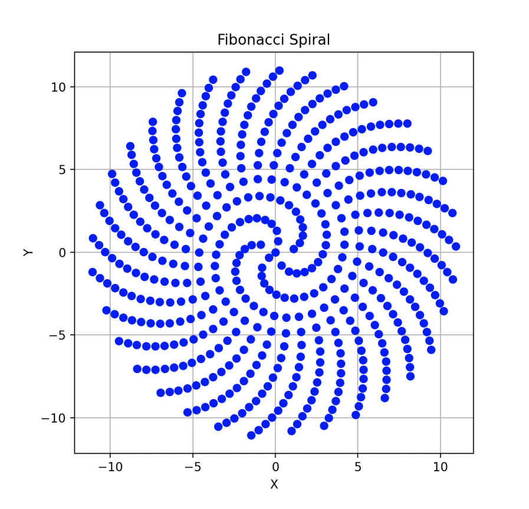

# Planet generation

## Overview
How planets are generated

## Description
A planet region is defined by a point and a region type. The perimeter of the region is retrieved by applying the Voronoi method. Planets are generated by placing random points on a map. We generate regions represented by single points. Using a point and Voronoi, we can determine for each position the closest point (region) it belongs to.

Our planets also have a planet type. We first choose a random planet type, and then choose random planet region types that can exist on that planet.

- To generate a random planet, call this function `generate_random_planet(session: AsyncSession)`. It is inside `src/app/routers/spawn/planet_generation.py`. This method will generate a random planet region. From this planet region, it will generate a 5 x 5 grid. In each grid, a random point is picked, and a random region type is selected. This region type corresponds to the previously retrieved planet type. This function will return the ID of the generated planet.

## Fibonacci Spiral Planet Generation
The Fibonacci spiral pattern is utilized to determine the placement of planets in the universe. Each planet's coordinates are calculated based on its index, which represents the number of planets currently existing in the universe plus one.

 .

### Angle Calculation
The angle for each planet is determined using a variation of the golden angle, derived from the golden ratio. This ensures even spacing between planets around the origin.

### Radius Calculation
The radius for each planet is calculated using the Fibonacci sequence. The square root of the index is multiplied by a scaling factor to spread out the planets gradually, creating a spiral pattern.

## Additional Information
- This feature is fully tested using pytest.
