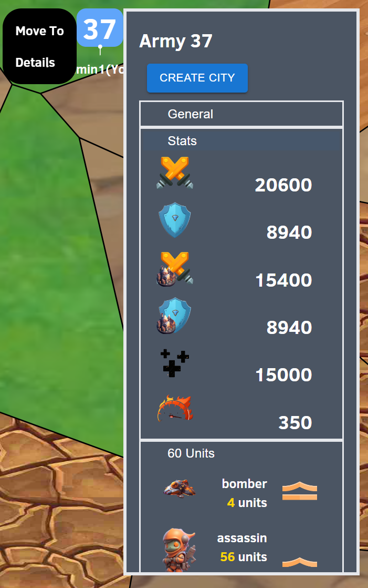

# Army Viewer

## Overview

The Army Viewer component is a movable window within a web application that displays information about a specific army. It allows users to interact with this army, including moving its position and creating cities at the army's location.

## Technologies Used

- **ReactJS**: Utilized for building the user interface. 
- **FastAPI**: Used for backend operations for army movement / creating cities / getting army info
- **Material-UI**: Used for the UI components (`Button`, `TextField`, `TreeView`, `TreeItem`) 
- **Axios**: Used for making HTTP requests to the FastAPI backend from the React frontend.
- **React Draggable**: Provides draggable capabilities to the Army Viewer window, allowing users to reposition it within the interface.

## Description

The `ArmyViewer` component is designed as a window that provides detailed information about an army identified by `armyId`. It fetches and displays the troops associated with the army, allowing users to view the total count and individual details of the troops. 
Displaying the troops their rank amount and type. We are also able to see the combat stats of the army
 

The component offers functionalities too:
- **Move Army**: Users can specify new coordinates (`x`, `y`) to relocate the army. 
- **Create City**: Allows users to create a city at the army's current location, utilizing the army's `planet_id` and coordinates.
- **Split**: Allows user to split off selected troops, and use them to from a separate army

