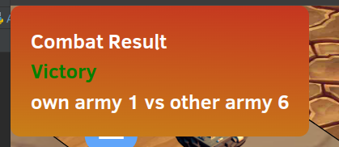

# Combat Notifications

When army combat occurred, when a user is online, we will display for a short time (5 seconds) a notification
about the combat results.
  
This notification is handled by the global websocket, and it displays the battle results of combat that
did occur