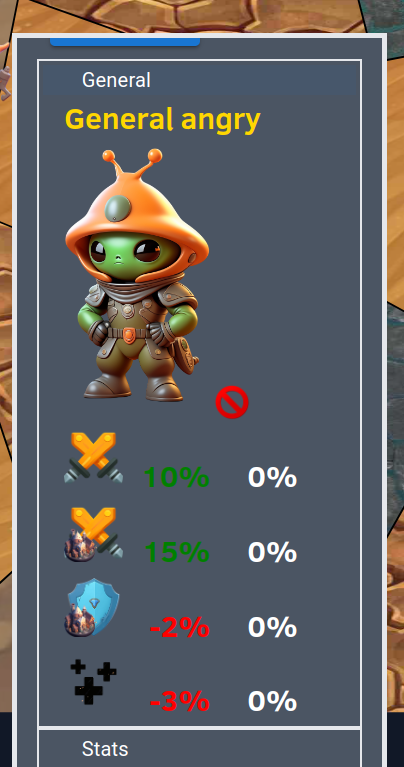

# GeneralView

When looking at the details of an army, we can also see information about the general of the army

 

When we click on the general, a list appears, of all the available generals,
we can select such a general to override the current general.

Each general provided stats that it gives a bonus to. General bonuses for each general also depend
on the political direction of the user. The second modifier gives an indication of this modifier.
