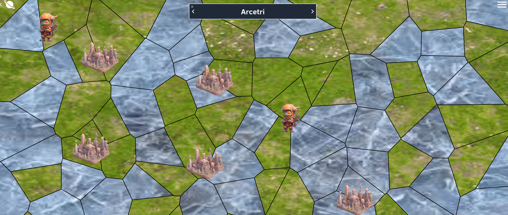

# Planet Viewer

## Overview
A view of the planet in 2D. The user is able to zoom and pan along the map freely.

## Technologies used
- ReactJS
 - react-map-interaction
- TailwindCSS

## Description
react-map-interaction package is used for the zoomable and panable map. Furthermore on the top there is also the name of the planet and two arrows which makes it possible to switch between planets. 

 

The planet view is filled with armies and cities that are present on the planet.

## Issues
None

## Additional Information
/
