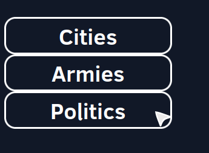

# Politics menu

## Overview
Showing the political stance of the user's society and allowing the user to influence it. 

## Technologies used
- ReactJS
- chart.js

## Description
Third menu we can access through the [profileViewer](profile_viewer.md)

 

When this button is clicked the political menu will open and we see 2 distinct sections:

### section 1: current society

Here we see a radar graph showing how far the user's society leans into the different types of governments. 

 

Under this graph we see the modifiers that the user gets because of their society type. 
These modifiers can affect the game in both positive or negative ways. This is shown by the color of the modifier. 
There is also an upper and lower bound of +30% and -30% respectively. This way a modifier cannot make the game unplayable or way too easy. 

 

### section 2: possible decisions

Under the description of the current society there is a list of a bunch of decisions that the user is able to enact. 
These decisions influence the type of the user's society and cost a certain amount of resources. 
This cost is shown in the top right above the button to enact a decision. 

 
