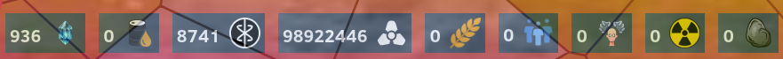

# Resource Viewer

## Overview
A window where the owned amount and collection rate of different resources is visualized.
 

## Technologies used
- ReactJS
- Material UI
- react-draggable
- JSON
- Redux

## Description
This resource Viewer displays the resources from the user. Using redux we globally store this resource information, 
and refresh this when the amount would be altered.

## Additional Information
The profile window on the bottom-left corner renders component Resources to display the resources of the player.
