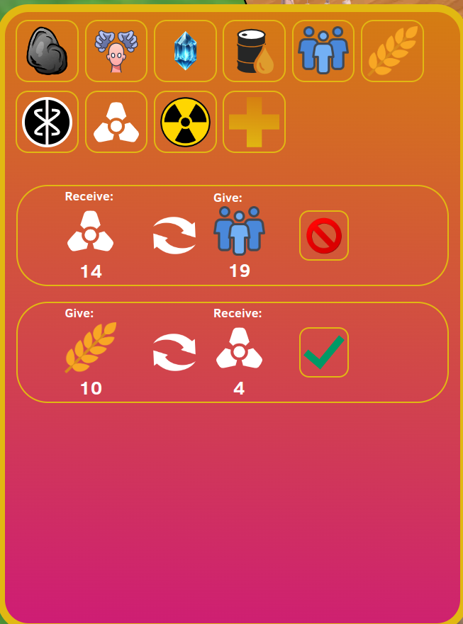
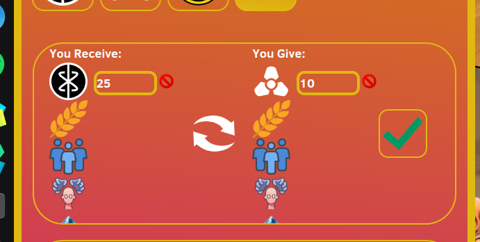

# Trading

## Overview
Shows The trading menu

## Technologies used
- ReactJS

## Description
Trading Menu can be opened using the trading button.
After opening the following menu appears:
 

The react component 'TradingMenu' manages this menu.

The trading has a view filter to filter on specific resources.
This filter management is done by the 'ResourceFilter' component.
This makes sure when you press a filter that the filter data is changed.
THe Trading Offers themselves are 'TradingOfferEntry' components. These components also receive
a filter. If the filter does not match the resources that would have been received

Clicking on the 'Plus' icon add the resource filter will open a create trade offer menu
 
This Menu is an 'AddTradeEntry' component. This allows users
To create new trades.

Both the receive and give side of this list have a list of all possible resources.
When a resource is selected, It will appear on that side on the offer and has a provided number. this number
indicates the amount of this resource the user want to trade. This list of resources will only show
the resources not yet selected on either side. Because it is useless to have 2 entries for the same resource or 
trade a resource to both sides (can be done by just not trading).
