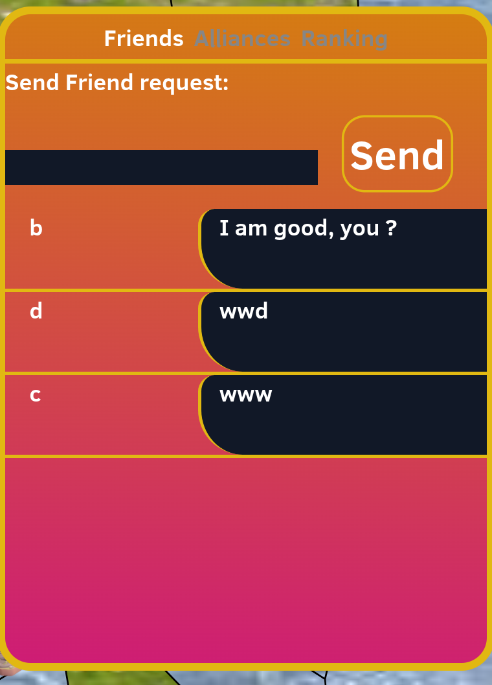
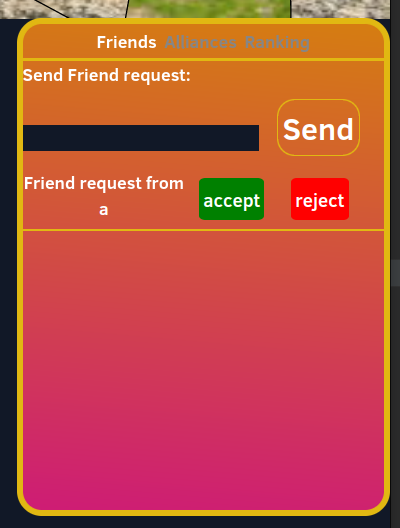
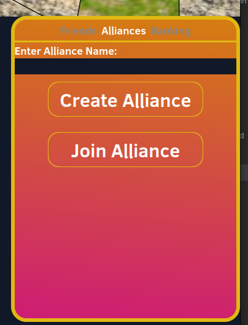
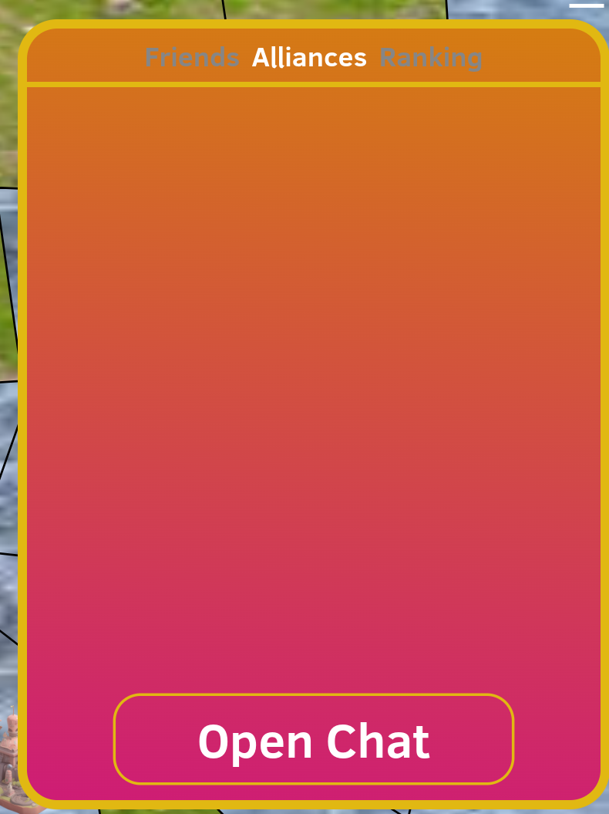
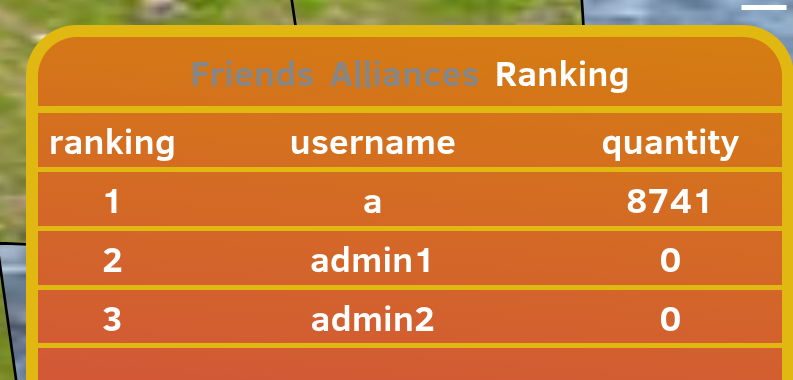
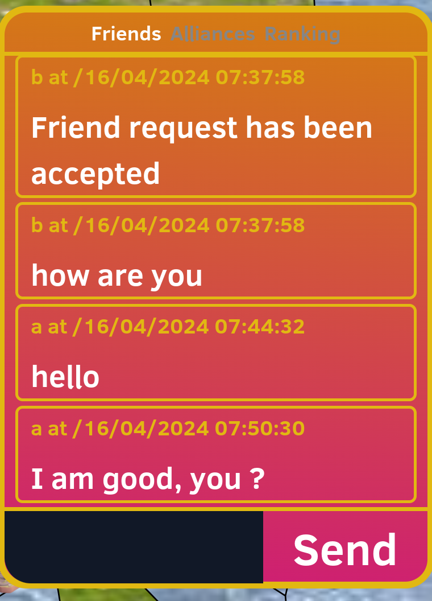

# Chat Menu

## Overview
Explanation about the entire chat menu and mechanics

## Technologies used
- React js
- FastAPI
- Websockets

## Description
Our chat component is a vital part of our game, it allows players to communicate with each other
We can open the chatMenu using the chat icon. 
The ChatIcon component can be found in UI > ChatMenu > ChatIcon
When this icon is pressed it opens a chat menu
This chatMenu has 3 categories. We can select a category, and it will display the corresponding front-end components.
The chatMenu is shown as the component 'ChatMenu'. When a category is selected, the chatMenu will show the corresponding Tab component, (Friends -> FriendsTab, ...)

3 Categories:
### Friends

<strong>Dm Overview</strong>

The friend component will make it possible to communicate with friends
When first selecting this category we will receive an overview with a list of your friends and the last message send between you and them
Also friend requests can appear here and by the press of a button can be accepted or rejected.
When the user clicks on an entry in the overview it will automatically open the message stream between the 2 users
The main component for the overview is called 'FriendsTab'.
To retrieve an overview from the backend we use a get request from the /chat/dm_overview
endpoint. This endpoint will return the overview information: a list of friends their (username, message board id, last message send between the users).
For each overview entry a 'FriendOverviewEntry' will be created. The friends overview will be ordered starting with the latest send message on top 
and decreasing in create time of the last message.

 

<strong>Friend requests</strong>

When a friend request is send to a user, the receiving user will have an entry for the friend request in its DM overview.
2 Buttons will appear:
- Accept: the friend request will be accepted, and the accepting user will send an automatic message in the group indicating that the friend request ahs been accepted
- Reject: removing the friend request from the pending friend requests

 

To do these operations some communication with the backend is needed.
First we want the pending friend requests to appear in our overview, we do this in the 'FriendsTab' component
We send a get request to the endpoint /chat/friend_requests, this will return a list of all the pending friend requests to the current user.
For each of these friend requests a 'FriendRequestEntry' will be created.
These FriendRequest will appear before the friendOverview entries.

Friend request will be quiet similar to Alliance requests (at least on the frontend), so we will have an 'RequestEntry' which will just be
a template component for requests, the 'FriendRequestEntry' will be just a wrapper around it, changing some parameters.

### Alliances

<strong>Alliances Overview (when not in an alliance)</strong>

If the user is not yet in an alliance the alliance category doesn't show much
An text entry field will appear to enter an alliance name, below both a 'create alliance' and 'join alliance'
button appear.

When we press the 'create alliance' we try to create an alliance with the name provided in the text input entry.
This will call the front-end function 'doAlliance' making a post request to endpoint /chat/create_alliance.
The endpoint will return a json, with a parameter 'success', if 'succes' is false the new alliance could not be created.
if true, the alliance is created and the user will directly see the screen it would see if it is in an alliance.

When we press the 'join alliance' we will send a request to the alliance (corresponding to the text input) to ask their alliance.
They will receive an alliance join request. When the user decide to try to join another alliance, the original request will be removed.

 

<strong>Alliances Overview (when in an alliance)</strong>

When you are in an alliance below, a button 'Open chat' appears.
When we press this button we will go to the chat of the alliance.
This overview will also show a list of all players who want to join the alliance.
We can accept or reject users. These components are called 'AllianceRequestEntry', and behave similary to friend request entries,
but has as backend endpoint /chat/alliance_requests

Below the list of alliance join requests a list of current alliance members will also be provided
and also the option to leave this alliance

 

### Ranking

<strong>Player Ranking</strong>

The category ranking shows the top 30 ranking of players, based on a 'quantity'. This quantity is the amount of solarium a player has

 

### Message Board

<strong>Messages</strong>

The most important part of a chat system, is that users can communicate with each other.
When we open a chat, the 'MessageBoard' component is shown.
This component contains a scrollable div, so users can scroll to the chat messages. We don't want to oad all the messages
immediately so we use the technique of 'paging'. When a user scrolls to the top of the messages, it will ask the server for the older messages.
We also want to make sure that messages send by other users will arrive directly, without needing to refresh anything.
That is why we use websockets. These websockets receive and send json format information.

The requests send from sever to client:

- type:
  - "paging": gives some messages, from a paging request (also first load)
  - "new message": gives a new message
- message: list of messages with format 
{"sender_name": name, "created_at":string representation of a timestamp, "body": text of message}

The requests send from client to server:

- type:
  - "paging": gives some messages, from a paging request (also first load)
  - "new message": gives a new message
- Offset (only when paging): offset of the messages we want to request
- Limit (only when paging): limit of amount of messages we want to receive
- body (only when new message): body of the new message

Messages can be sent by pressing the button, at the bottom  of the chat menu called 'Send'.
The bottom also contains an input field so users can enter their text. This part has its own component called 'SendMessage'

 

The Messages themselves are inside the component 'Message', which gives the message the right visual format.

