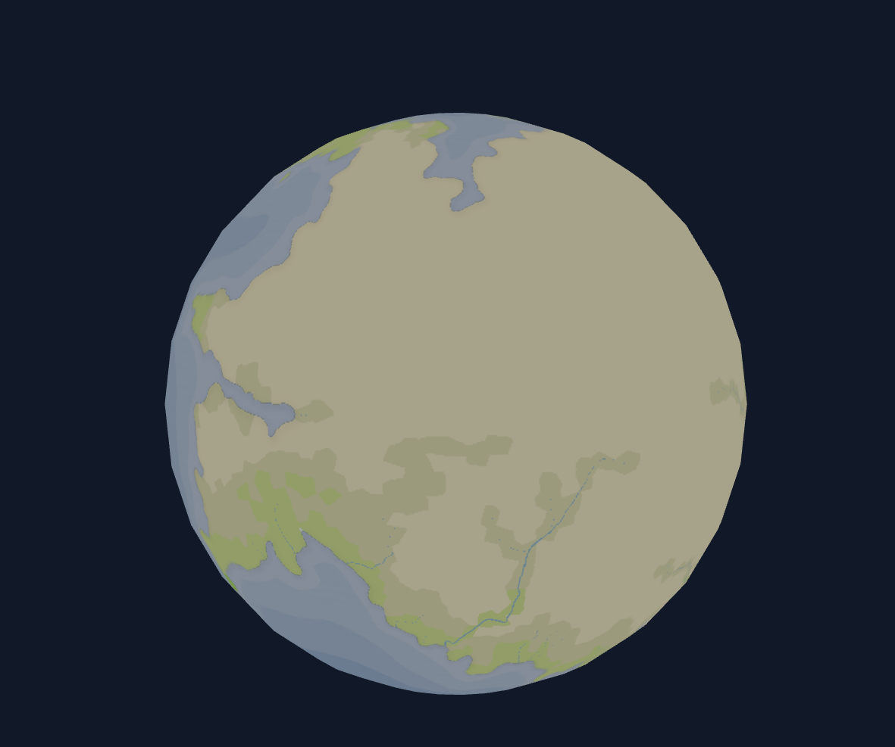

# Galaxy Viewer

## Overview
Shows a galaxy with 3D planets where you can rotate around but also click to select the planet and double click to go to planet view.

## Technologies used
- ReactJS
 - react-three-fiber (ThreeJS)
 - react-three-drei

## Description
ThreeJS is used to display the planets in 3D as well as stars and a central star in the middle.  This is done by loading a 3D sphere and a 2D image of the map for planets and the Star component from react-three-drei. 

 

## Issues
None

## Additional Information
None
