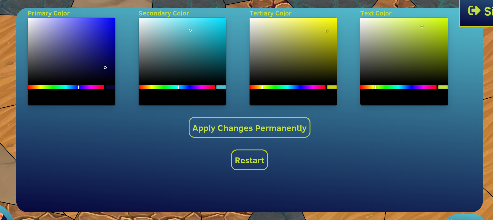

# settings

## Overview
Front end explanation of the settings menu

## Description
In the right top corner, at sidebar button is displayed.
When clicking on it the sidebar menu is opened, and it visualizes
a settings menu

 
This Settings menu, gives you the opportunity to change your own visual theme colors.
All components whose colors are configurable use the following colors:
- Primary Color
- Secondary Color
- Tertiary Color
- Text Color

The text color is straightforward, it changes the color of the text.
The other 3 colors are used by the developers, based on what would have the best visual results 
(In case a user selects different colors) (In short, we use the 3 colors to make it possible to have a good looking page,
while leaving space for customization).

In the settings menu we have a button 'Apply Changes Permanently'. When a user makes color changes, these changes are local
and the next time you open the game, you will receive your original colors (see it like a color demo tryout).
When you select the button. these changes will persist and remain the next time you open the game.

The game also has a 'Restart' button. Sometimes the player makes decisions, which will cause the player to be in an annoying situation.
Like lack of a resource, and nobody wants to trade. In that case, the player can just restart the game using the 'Restart' button.