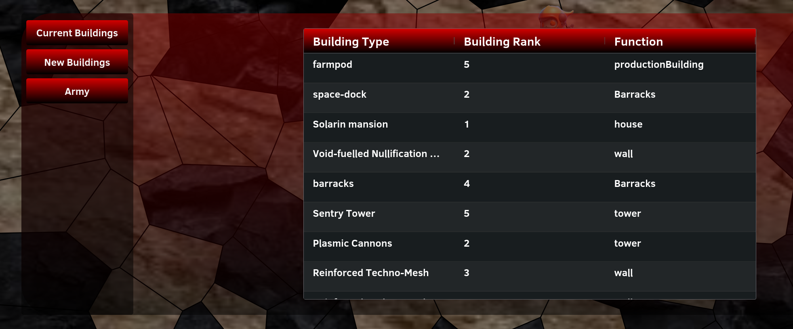
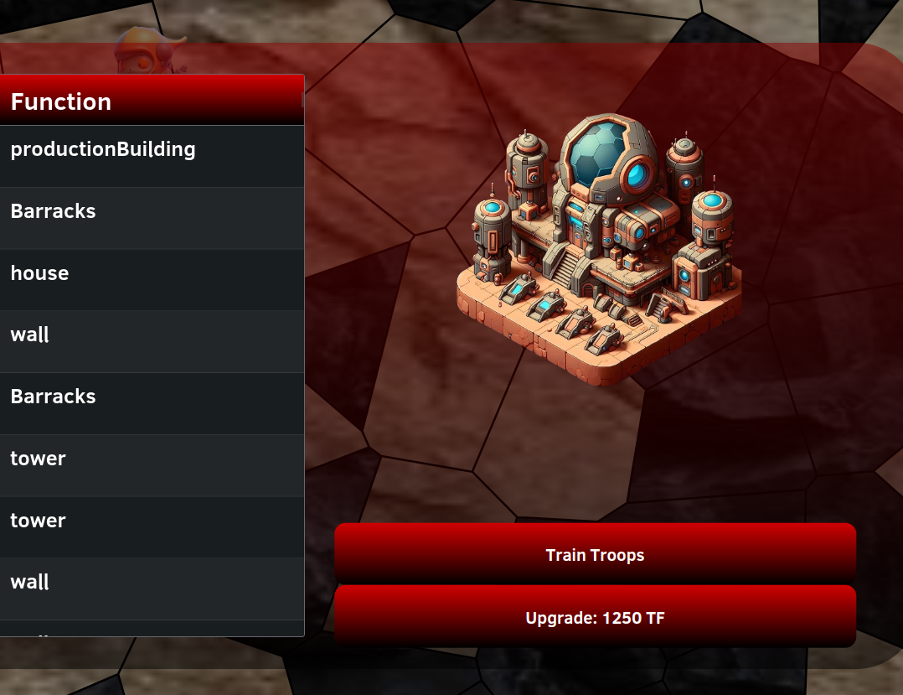
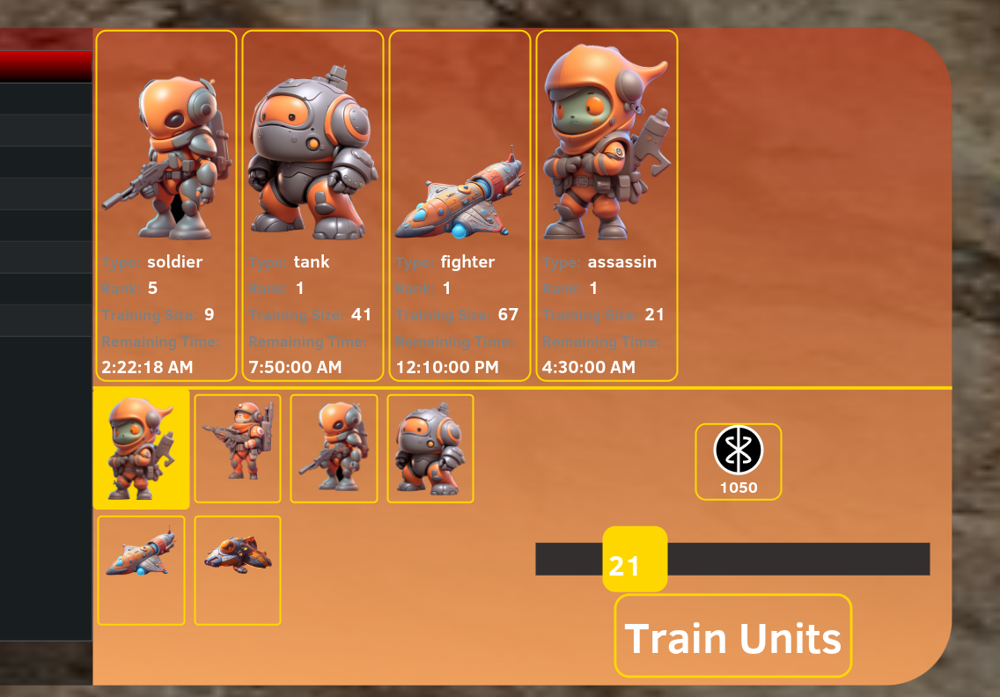
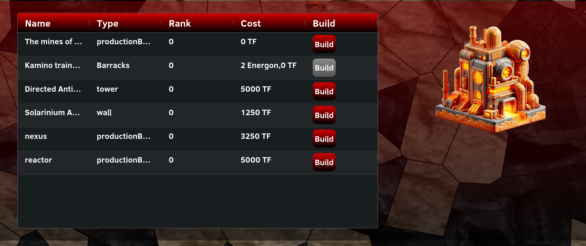
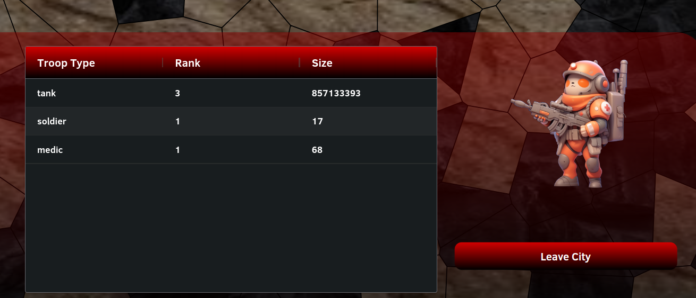

# City Management

When we click on a city that we own, the following menu appears:
 
On the leftSide we have 3 Tabs. When we open our menu we are by default
in the current buildings Tab. Each entry in this table represents a building, containing the building name, rank and purpose type
When we hover over a row entry of the building list, an image of the building will appear
on the right side:
 .
Above the preview additional buttons appear.
These buttons depend on the type of building. Buildings that produce a certain resource will
have a 'Collect' button, while barrack type buildings have a 'Train Troops' button.
We also have an upgrade button to be a able to upgrade buildings (and improve their stats)
When we press the Collect button, the currently produced resources of the building will be added to the user
its resources. The Train Troops button will open a training interface:
 .
The current training queue of this building type appears. If the queue is too long horizontal scrolling
will be possible using mouse scroll. In the lower half of the menu, it is possible to select
a unit, and use the slider to decide how many you want to train. When pressing the 'Train Units' button, our unit
will be added to the training queue.

Another Tab we have is the 'New Buildings' tab.
When we select this tab the following will appear:
 
This shows a list of buildings we can still build inside this city 
(When build button is gray, we do not have enough resources to build this building).
When we press the 'Build' button we will build the building.

We also have an army tab, this will show all the troops that are present inside the city (grouped as 1 army):
 
When we press the Leave City button our army will leave the city.