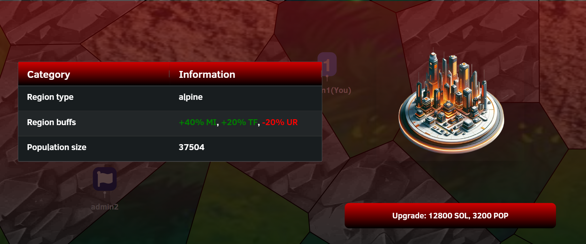

# City Management

When you click on a city you own, the following menu appears:
 

### Current Buildings Tab
By default, you are in the Current Buildings tab. On the left side, there are four tabs.  Each entry in this table represents a building, displaying the building name, rank, and purpose type. When you hover over a row entry of the building list, an image of the building appears on the right side:
 

Below the building image, additional buttons appear. These buttons vary depending on the type of building. Buildings that produce a resource have a 'Collect' button, while barrack-type buildings have a 'Train Troops' button. An upgrade button is also available for all building types to increase building ranks and improve their stats.

Pressing the 'Collect' button adds the produced resources of the building to the user's resources. The 'Train Troops' button opens a training interface:
 

The current training queue for this building type appears. If the queue is too long, horizontal scrolling is possible using the mouse scroll. In the lower half of the menu, you can select a unit and use the slider to decide how many you want to train. Pressing the 'Train Units' button adds the unit to the training queue.

### New Buildings Tab

Selecting the 'New Buildings' tab shows the following:
 

This displays a list of buildings you can still construct within the city. If the build button is gray, you do not have enough resources to build the building. Pressing the 'Build' button initiates the building process.

### Army Tab

The army tab shows all the troops present inside the city, grouped as one army:
 

Pressing the 'Leave City' button makes your army leave the city.

### City Info Tab

The final tab is the City Info tab. It contains relevant information about the city, such as the population (determined by the rank), the region type in which the city is built, and the production buffs that apply as a consequence:
 

Pressing the 'Upgrade City' button starts the process of upgrading the city to the next rank. The button will appear as grey and disabled in three cases:
1. The city is currently being upgraded 
- the button will then display the remaining update time, and updating will be possible again once this timer hits 0.
2. The user has insufficient resources for an upgrade
- In this case a city rank upgrade is possible, but the user has insufficient resources. The button will be enabled again once sufficient resources have been acquired.
3. The city is rank 5
- The maximum rank a city can have, is rank 5. Once this rank is reached, no further upgrades are possible and the button will remain disabled indefinitely.
