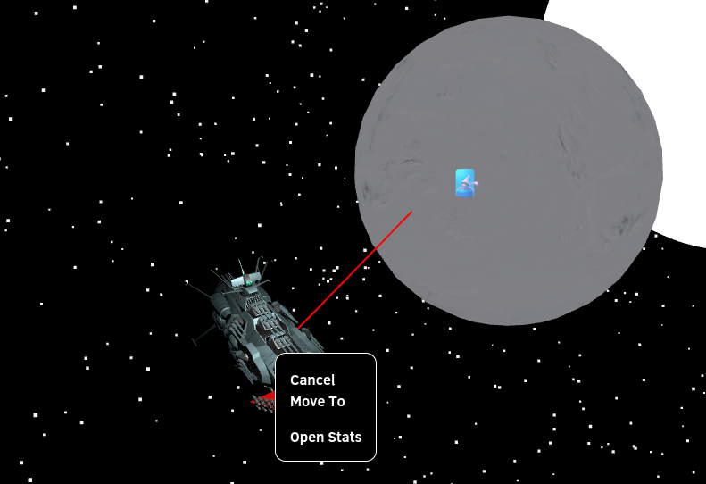

# Fleets 
 
Fleets, which are armies with at least one mothership unit,  are just like armies in terms of combat, merging, moving, viewing stats, etc... (See /game_explanation/armies).
However they can also enter and exit planets.
 
Fleets can enter planets almost the same way as armies can enter cities. However (currently) when a fleet enters a planet it spawns in the middle of the map.
Another difference is also a red line indicating the current position selection.
  
In order for a fleet or multiple fleets to exit a planet, the user must click the planet -> show fleets -> exit planet. After which the fleets should spawn next to the planet in space.
