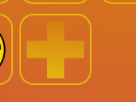

# Trading

Trading between users is a vitale part of improving the strategy component behind our game
Users can only trade with players in the same alliance, and so when a player is not yet in an alliance,
the player cannot use this feature.

When You open the trading menu you will see the following page:
 

In The top of the screen we see a list of resources. You can click on such a resource to set a filter 
to see the trade offers containing this filter.

Trade offers list 2 things. Your own placed trade offers and others their placed trade offers.
Filters will be checked on the resources the checking user will receive when the offer is accepted.
Own trade offers appear at the top and can be cancelled using the red cancel button.

Others their trade offers can be accepted using the green accept button.
When your own offer is canceled your offered resources will be refunded. When a trade offer is accepted,
the resources will be exchanged. When a user does not have the resources to accept the offer, no accept button
will appear.

Users can also create trade offers.
Among the resources a 'PLUS' icon appears.  
When we click this button a create trade offer menu will appear.

 
Both The receive and give side have a scrollbar with resources that you can select.
When selecting you want to trade that resource, and you can choose an amount.
Clicking the accept button will confirm your trade offer.
