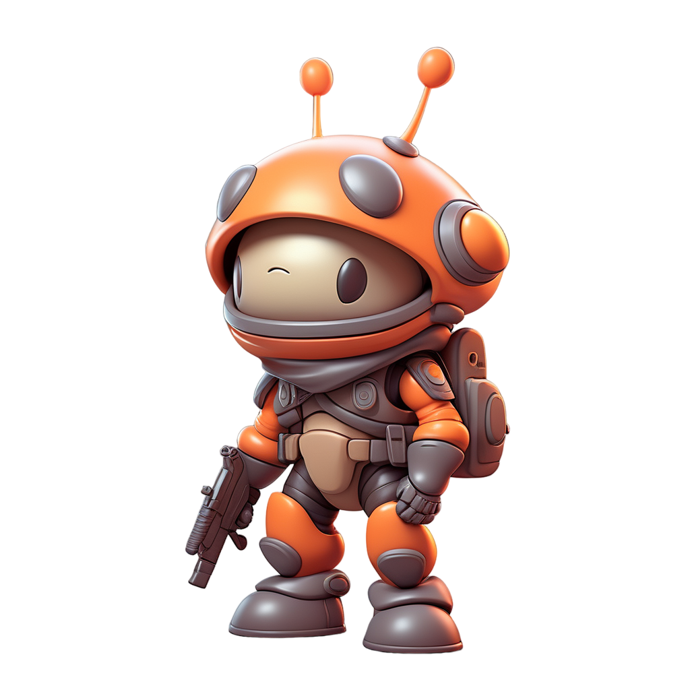
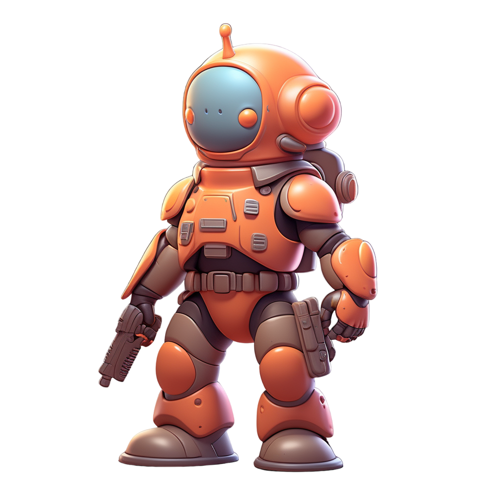

# Generals
Generals can be assigned to an army to give an army some bonuses.
Generals are named after emotions/ behaviour attributes.
We have the following generals:

## Brave

- Attack: +10% * (1+Democratic)
- City Attack: +5% * (1+Authoritarian)

## Sad

- Recovery: +15% * (1+Religious)
- Speed: +10% * (1+Authoritarian)
- Defense: -5% * (1+Religious)
- Attack +2% * (1+Democratic)

## Angry

- Attack: +10% * (1+Authoritarian)
- City Attack: +15% * (1+Authoritarian)
- City Defense: -5% * (1+Democratic)

## Confused

- Recovery: -5% * (1+Anarchism)
- Speed: -5% * (1+Democratic)
- Defense: +10% * (1+Anarchism)

## Emphatic

- Recovery: +10% * (1+Religious)
- Speed: -10% * (1+Corporatism)
- City Defense: +15% * (1+Religious)

## Afraid

- Attack: -15% * (1+Corporatism)
- Defense: -10% * (1+Democratic)
- City Attack: +30% * (1+Corporatism)
- City Defense: +30% * (1+Religious)

## Calm

- Recovery: +10% (1+Democratic)
- Defense: +5% * (1+Anarchism)
- Attack: +2% (1+Religious)
- City Defense: -5% * (1+Anarchism)

## EmotionLess

- Recovery: -40% * (1+Authoritarian)
- Speed: +5% * (1+Corporatism)
- Defense: +10% * (1+Democratic)
- Attack: +30% * (1+Authoritarian)

